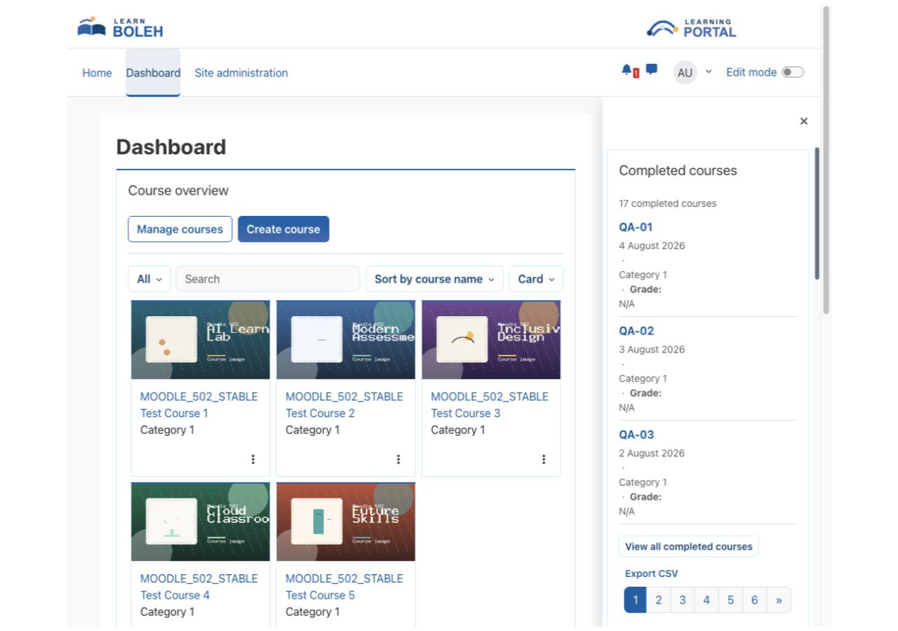

# Completed courses

Completed courses gives Moodle learners a compact dashboard list of the courses they have completed, with configurable details, paging, course links, and a permission-controlled CSV export. A personal transcript opens from the block and lets learners filter their own visible completion records.

## Key features

- Show only the signed-in user's visible completed courses.
- Choose short or full course names, completion-date order, and rows per page.
- Optionally display category, completion date, and final grade information.
- Filter hidden courses according to Moodle access rules.
- Export the same visible completion list as a formula-safe CSV file when permitted.
- Keep the block compact and readable in narrow dashboard regions.
- Open a personal transcript with course search, category and completion-date filters, completion-date ordering, and paging.
- Optionally show course ID numbers alongside the configured course details.
- Follow course, completion-details and grade-report links only where Moodle permissions allow them.

## Screenshots

### Learner dashboard block

*The block presents completed courses with the details selected by the administrator. All people, courses, and results shown are fictional demonstration data.*

## Requirements

- Moodle 4.5 through 5.2.
- Course completion must be enabled and configured for the relevant courses.
- Users need access to the courses that should appear in their list.
- No external service or additional Moodle plugin is required.

## Installation

Download the Completed courses ZIP from its verified [Moodle Marketplace listing](https://marketplace.moodle.com/plugins/block_completedcourse). In Moodle, open **Site administration > Plugins > Install plugins**, upload the ZIP, complete validation, and follow the displayed upgrade steps.

## Configuration and use

### Add and configure the block

Turn editing on for a supported block region, add **Completed courses**, and configure the course-name format, ordering, page size, category hierarchy, date format, category and grade display, hidden-course handling, and link target.

Choose a page size from 1 to 100. Course ID numbers are optional and disabled by default. The block's category and visibility settings also constrain its transcript; learner filters cannot widen those settings or grant access to otherwise inaccessible courses.

### View a personal transcript

Select **View all completed courses** in the block. Search for a course, optionally narrow the category and completion-date range, choose the completion-date order, and apply the filters. Reset the filters to return to the block's configured completion list. Results are paged, and the transcript reports the matching result count.

The transcript belongs to the block instance from which it was opened. Different block instances can have different settings. It always shows the signed-in learner's records; it is not a manager report and cannot display another learner's completion history. Course and report links remain subject to the user's current Moodle access and capabilities.

### Export completion records

The CSV action appears only for users with `block/completedcourse:export`. The export contains that user's visible completed courses and protects values that spreadsheet software could otherwise interpret as formulas.

An export from the transcript respects its active filters and configured columns. It does not include other users' results or courses outside the block's configured scope.

## Privacy and permissions

The block stores configuration but no personal data of its own. It reads the signed-in user's Moodle completion and grade records when the block is displayed and sends nothing to an external service. It does not accept a user identifier and cannot be used to browse another person's completion history.

Moodle capabilities control block visibility, instance management, and CSV export. Normal Moodle course visibility rules continue to apply.

## Troubleshooting

- If the block is empty, confirm that course completion is enabled and the learner has completed at least one visible course.
- If grades are missing, confirm that grade display is enabled and the learner has a final course grade that Moodle permits them to view.
- If CSV export is absent, check the `block/completedcourse:export` capability.
- If recent changes do not appear, refresh the page after Moodle has recalculated course completion.
- If the transcript has no matching results, reset the search and date filters, then check the block's category setting and the learner's current course access.
- If a course or report link is absent, check enrolment and Moodle permissions; a completion record does not itself grant access to the course or its reports.

## Support and licence

- [Report a Completed courses product issue](https://github.com/PukunuiMalaysia/moodle-docs/issues/new?template=product-bug.yml)
- [Request a Completed courses feature](https://github.com/PukunuiMalaysia/moodle-docs/issues/new?template=feature.yml)
- [Report a documentation issue](https://github.com/PukunuiMalaysia/moodle-docs/issues/new?template=documentation.yml)
- [Pukunui Plugin Subscription Terms & Support Policy](https://pukunui.com/docs/policy-moodle-marketplace/)
- [Pukunui Malaysia](https://pukunui.com/location/malaysia/)

Completed courses is licensed under the GNU General Public License v3 or later. This documentation is licensed under [CC BY 4.0](https://creativecommons.org/licenses/by/4.0/).
