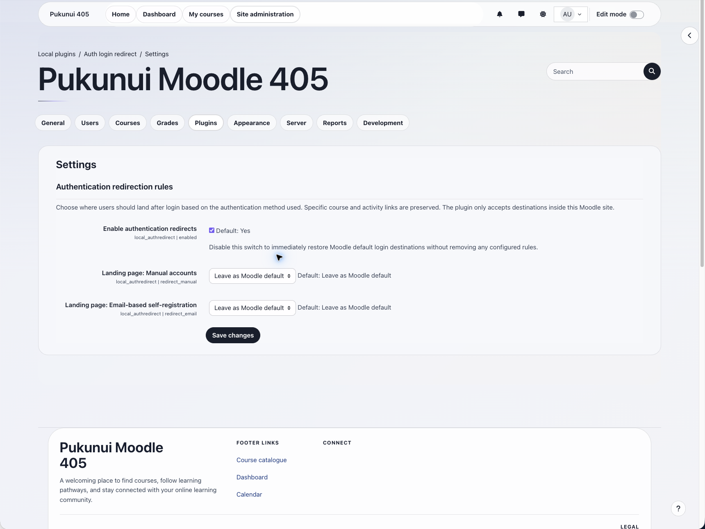

# Auth login redirect

Auth login redirect sends users to an administrator-selected landing page after login, based on the authentication method recorded on the Moodle account. It is intended for sites that combine manual accounts, self-registration, and enterprise single sign-on.

## Key features

- Configure a separate landing-page rule for each enabled authentication method.
- Choose Site home, Dashboard, My courses, the user profile, or a safe custom URL.
- Preserve course and activity deep links when Moodle supplies a specific return URL.
- Keep MFA, policy acceptance, profile completion, password-expiry, and authentication callback flows intact.
- Support OAuth2-style callback flows with a short-lived, one-shot session handoff.
- Fail closed for malformed, external, protocol-relative, and out-of-base-path custom URLs.
- Operate entirely within Moodle without database tables, external services, third-party libraries, or persistent personal-data storage.

## Screenshots

*The settings page provides the master switch and a landing-page selector for each enabled authentication method. All people, organisations, and content shown are fictional demonstration data.*

## Requirements

- Moodle 4.5 LTS through Moodle 5.2.
- Moodle 4.5: PHP 8.1 or later supported by that Moodle branch.
- Moodle 5.0 and 5.1: PHP 8.2 or later supported by those Moodle branches.
- Moodle 5.2: PHP 8.3 or later supported by that Moodle branch.
- No additional Moodle plugins, database tables, or external services.

## Installation

Marketplace publication is pending. If Pukunui has provided the pre-release plugin ZIP, open **Site administration > Plugins > Install plugins**, upload the ZIP, complete Moodle's validation and upgrade steps, and then open **Site administration > Plugins > Local plugins > Auth login redirect > Settings**. No post-install build or manual database step is required after upload.

## Configuration and use

Open **Site administration > Plugins > Local plugins > Auth login redirect > Settings**. Leave **Enable authentication redirects** enabled, then choose a destination for each authentication method. **Leave as Moodle default** preserves Moodle's normal return-url behaviour for that method.

The built-in destinations are Site home, Dashboard, My courses, and the user profile. To use a custom destination, select **Custom URL** and enter a path such as `/mod/page/view.php?id=10`, or an absolute URL with the exact configured Moodle origin and base path. External and protocol-relative URLs are rejected.

The plugin only overrides an empty return URL or an exact standard landing page. Specific course, activity, profile, policy, MFA, and other internal routes remain untouched. Query strings and fragments are preserved as intentional deep-link data except for Moodle's root `redirect=0|1` control.

Authentication plugins that perform their own callback redirect receive a one-shot target in the Moodle session. The plugin consumes it only on the next standard landing page, expires the marker after ten minutes, and clears it before redirecting. Intermediate policy, MFA, profile-completion, password-expiry, and callback pages are not interrupted.

## Privacy and permissions

The plugin does not create database tables or send data to an external service. It temporarily processes the current authentication method and destination in Moodle's existing session. Its Privacy API declaration reflects that it does not retain personal data for export or deletion.

Only administrators with Moodle site configuration access can change the plugin settings. The plugin is a navigation aid, not an access-control mechanism; destination pages continue to enforce their own login, capability, and enrolment checks.

## Troubleshooting

- If no redirect is applied, confirm that **Enable authentication redirects** is on and that a rule matches the user's account `auth` value.
- If a course or activity link is preserved, that is expected deep-link behaviour.
- If an SSO provider lands on an intermediate policy or MFA page, complete that flow; the deferred target is intentionally not consumed there.
- If a custom destination is rejected, check that it is site-relative or uses the exact configured Moodle origin and base path.
- Clear Moodle caches after changing the enabled authentication plugins so the dynamic settings list is rebuilt.
- Before upgrading beyond Moodle 5.2, confirm that a newer plugin release explicitly supports the target Moodle version.

## Support and licence

- [Report an Auth login redirect product issue](https://github.com/PukunuiMalaysia/moodle-docs/issues/new?template=product-bug.yml)
- [Request an Auth login redirect feature](https://github.com/PukunuiMalaysia/moodle-docs/issues/new?template=feature.yml)
- [Report a documentation issue](https://github.com/PukunuiMalaysia/moodle-docs/issues/new?template=documentation.yml)
- [Pukunui Malaysia support](https://pukunui.com/location/malaysia/)
- [Contact Pukunui Malaysia](mailto:hello.my@pukunui.com)

Auth login redirect is licensed under the GNU General Public License v3 or later. This documentation is licensed under [CC BY 4.0](https://creativecommons.org/licenses/by/4.0/).
