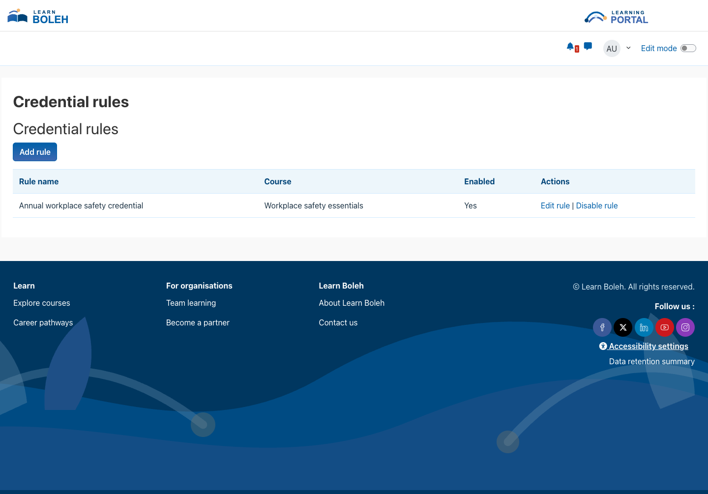
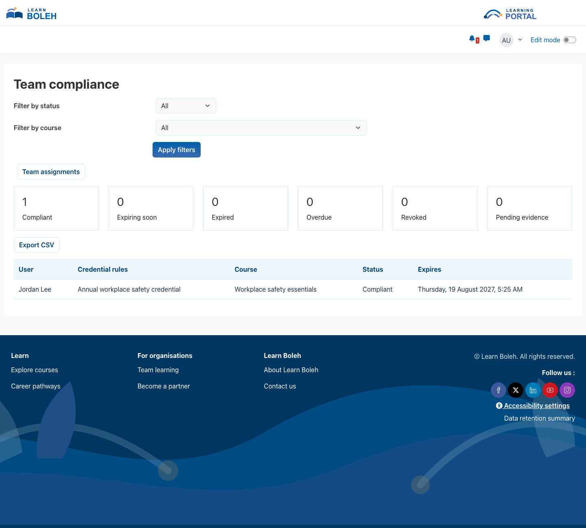
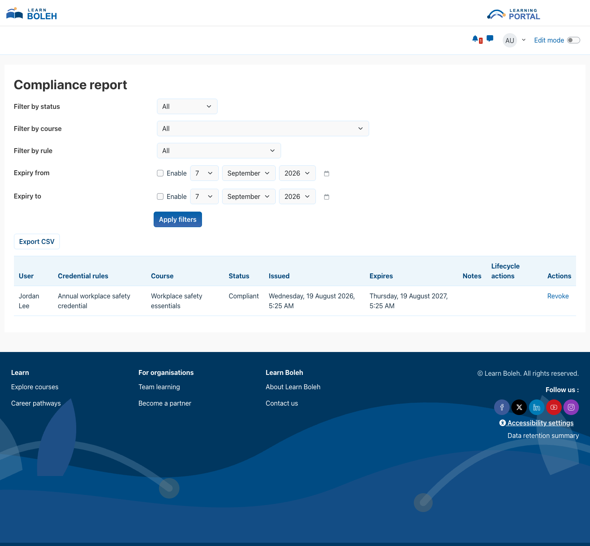

# Credential Lifecycle Manager

Credential Lifecycle Manager helps Moodle sites issue, renew, monitor, and verify time-limited training credentials linked to course completion or reviewed offline evidence.

## Key features

- Map a credential rule to a Moodle course and issue or renew credentials after course completion.
- Use duration, fixed annual date, or fixed-date validity models with configurable renewal windows and grace periods.
- Let learners submit offline evidence through Moodle's File API and give authorised reviewers an auditable approval or rejection workflow.
- Show learners their own credential history and give authorised managers scoped team-compliance views.
- Filter and export site compliance reports, and import validated credential history from CSV in queued batches.
- Send reminders and evidence-review notifications through Moodle's Message API with controlled retry handling.
- Optionally reset course completion or suspend enrolments after expiry, with dry-run protection enabled by default.
- Offer optional rate-limited public verification that discloses only credential details, dates, and current status.
- Apply configurable retention processing and Moodle Privacy API export and deletion support.

## Screenshots

### Credential rules

*Authorised administrators can create, edit, and disable course-linked credential rules. All people, credentials, courses, organisations, and dates shown are fictional demonstration data.*

### Team compliance

*Authorised managers can filter their assigned team and review credential status and expiry dates. All people, credentials, courses, organisations, and dates shown are fictional demonstration data.*

### Compliance report

*Authorised administrators can filter, export, and manage credential records from the site report. All people, credentials, courses, organisations, and dates shown are fictional demonstration data.*

## Requirements

- Moodle 4.5 LTS through Moodle 5.2.
- Regular Moodle cron execution for scans, reminders, retention processing, and queued imports.
- Moodle course completion for rules that issue credentials automatically from course completion.
- A database supported by the applicable Moodle release; the plugin is designed for MySQL and PostgreSQL compatibility.
- No additional Moodle plugin, third-party library, external service, or paid subscription is required.

## Installation

Marketplace publication is pending. If Pukunui has provided the pre-release plugin ZIP, open **Site administration > Plugins > Install plugins**, upload the ZIP, complete Moodle's validation and upgrade steps, and then open **Site administration > Plugins > Local plugins > Credential Lifecycle Manager > Settings**. No post-install build or manual database step is required.

## Configuration and use

### Review the safety defaults

Open **Site administration > Plugins > Local plugins > Credential Lifecycle Manager > Settings**. Review the default warning days, renewal window, grace period, batch size, notification behaviour, public-verification limits, retention mode, and legal-hold period. New installations keep destructive lifecycle processing in dry-run mode and public verification disabled until an administrator deliberately enables them.

### Create credential rules

Open the compliance hub and select **Credential rules**. Add one enabled rule for each course that should issue a credential. Choose duration from issue, a recurring annual expiry date, or a fixed expiry date. Configure the renewal window, grace period, reminder schedule, optional manager cohort, and any completion-reset or enrolment-suspension behaviour.

When Moodle records course completion, the plugin issues the first credential or archives the current record and creates a renewed credential. Lifecycle operations use locking and auditable action records so repeated background processing does not apply the same change twice.

### Review offline evidence

Learners can select **Upload evidence** from the compliance hub, choose an available rule, add a description, and upload supporting files. Authorised reviewers can approve or reject pending evidence and add a review comment. Approval issues or renews the related credential while preserving the evidence decision and files for the configured retention period.

### Manage teams, reports, and imports

The **Team compliance** page shows only users assigned to the current manager or included through a rule's configured manager cohort. Separate capabilities control team assignment, site reporting, CSV export, and CSV import.

Credential imports validate the exact CSV structure, Moodle username, course short name, rule, dates, status, and optional notes before queued processing. Use validation-only mode first, review row-level errors, and then submit a valid file for import.

### Enable public verification only when required

Public verification is disabled by default. When enabled, a verifier must enter the complete generated code. Successful results contain only the credential name, course, issue date, expiry date, current status, and validity result. Learner names, usernames, email addresses, Moodle user IDs, and profile information are not disclosed.

## Privacy and permissions

Credential Lifecycle Manager stores credential history, verification codes, certificate hashes, evidence descriptions and files, reviewer decisions and comments, notification logs, import batches and row errors, manager-to-team assignments, lifecycle actions, and short-lived hashed verification counters. The Moodle Privacy API provider declares this information and supports user-data discovery, export, deletion, and retention-aware anonymisation or removal where applicable.

System-context capabilities separately control rule configuration, personal credential viewing, evidence upload, team viewing and assignment, evidence approval, report viewing and export, imports, administrative verification, and credential revocation. Protected pages require login and the relevant capability. State-changing browser actions use Moodle forms or sesskey validation.

The plugin does not send credential or personal data to an external service. Public verification is optional, rate limited, and deliberately restricted to minimal credential information. Infrastructure-level rate limiting is also recommended for public internet deployments.

## Troubleshooting

- If course completion does not issue a credential, confirm that the rule and plugin are enabled, course completion is configured, and Moodle cron is running.
- If reminders, expiry states, or retention processing do not advance, check the relevant scheduled and ad-hoc tasks and leave dry-run enabled while reviewing lifecycle actions.
- If a learner cannot submit evidence or a reviewer cannot process it, confirm the relevant system-context capabilities and that the rule is enabled.
- If a manager cannot see a learner, review explicit team assignments and the optional manager cohort configured on the credential rule.
- If a CSV row is rejected, verify the exact header, username, course short name, rule name, dates, status, and note length reported for that row.
- If public verification fails, confirm that it is enabled, the complete code was entered, and the configured request limit has not been reached.
- Before upgrading beyond Moodle 5.2, confirm that a newer plugin release explicitly supports the target Moodle version.

## Support and licence

- [Report a Credential Lifecycle Manager product issue](https://github.com/PukunuiMalaysia/moodle-docs/issues/new?template=product-bug.yml)
- [Request a Credential Lifecycle Manager feature](https://github.com/PukunuiMalaysia/moodle-docs/issues/new?template=feature.yml)
- [Report a documentation issue](https://github.com/PukunuiMalaysia/moodle-docs/issues/new?template=documentation.yml)
- [Pukunui Malaysia support](https://pukunui.com/location/malaysia/)
- [Contact Pukunui Malaysia](mailto:hello.my@pukunui.com)

Credential Lifecycle Manager is licensed under the GNU General Public License v3 or later. This documentation is licensed under [CC BY 4.0](https://creativecommons.org/licenses/by/4.0/).
