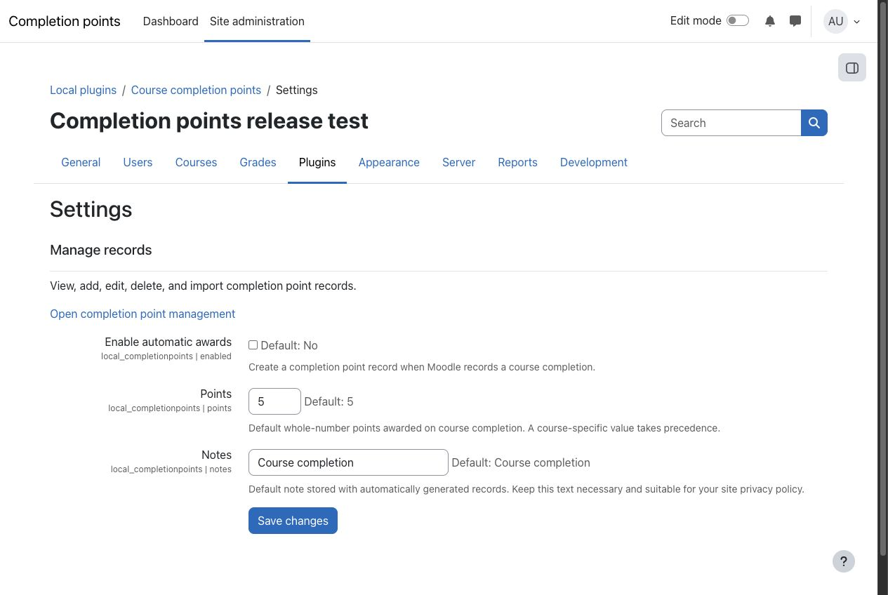
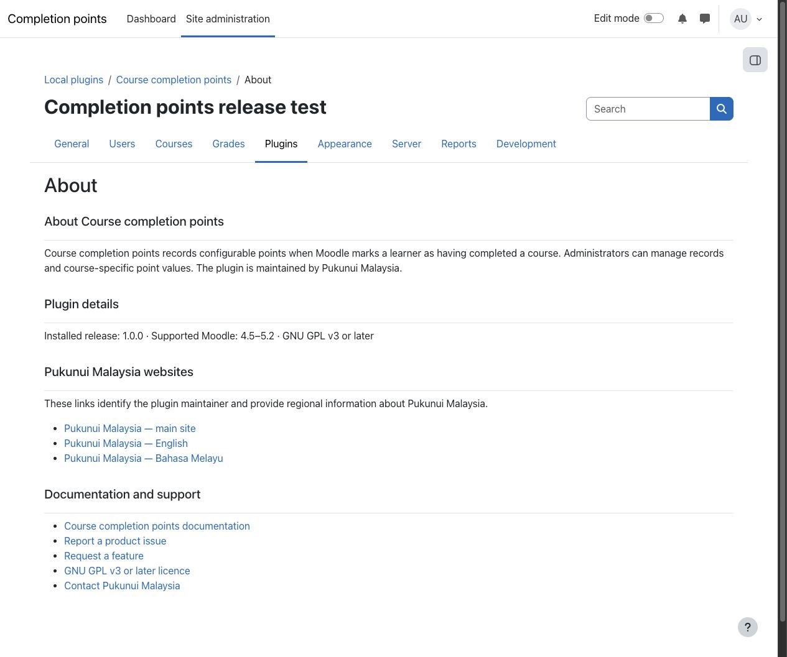
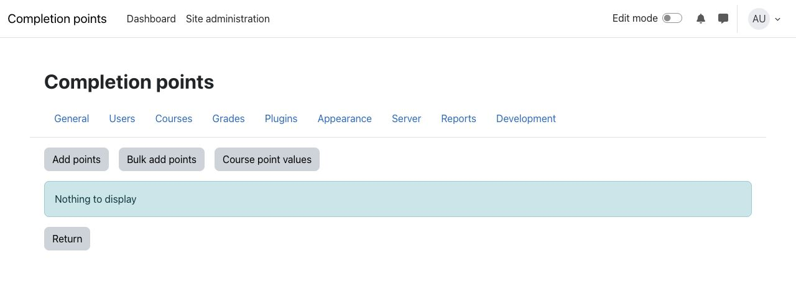

# Course completion points

Course completion points records configurable points when Moodle marks a learner as having completed a course. Site administrators can set a default award, override the value for individual courses, manage records, and import carefully prepared records from CSV.

## Key features

- Create one point record when Moodle records a course-completion event and automatic awards are enabled.
- Set a default whole-number award and a privacy-conscious default note.
- Override the point value for an individual course, including a zero-point award.
- Let authorised administrators view, add, edit, delete, and import records from one protected management area.
- Import up to 1,000 records per CSV file with validation and clear skipped-row feedback.
- Use Moodle's Privacy API to declare, export, and delete the user-linked data stored by the plugin.
- Operate entirely within Moodle without an external service, API credential, build tool, or paid dependency.

## Screenshots

### Settings



*The settings page keeps site-wide defaults and the protected record-management link together. All people, courses, organisations, and content shown are fictional demonstration data.*

### About



*The About page derives the installed release and supported Moodle range from plugin metadata. All people, courses, organisations, and content shown are fictional demonstration data.*

### Record management



*Authorised administrators can manage manual records, CSV imports, and course-specific values from this page. All people, courses, organisations, and content shown are fictional demonstration data.*

## Requirements

- Moodle 4.5 LTS through Moodle 5.2.
- Moodle course completion must be enabled for automatic awards.
- Any database supported by the applicable Moodle release.
- No third-party library or external service is required.

The optional Completion points view block can display records created by this plugin. The local plugin does not require that block and can be installed and used independently.

## Installation

Marketplace publication is pending. If Pukunui has provided the pre-release plugin ZIP, open **Site administration > Plugins > Install plugins**, upload the ZIP, complete Moodle's validation and upgrade steps, and then open **Site administration > Plugins > Local plugins > Course completion points > Settings**. No post-install build or command-line step is required.

## Configuration and use

### Configure automatic awards

Open **Site administration > Plugins > Local plugins > Course completion points > Settings**. Enable **Enable automatic awards**, enter the default whole-number **Points**, and provide a concise **Default note** suitable for the site's privacy and retention policies.

When Moodle records a course completion, the plugin creates one point record using the course-specific value when one exists, or the site default otherwise. Disabling automatic awards stops new event-generated records without deleting existing data.

### Manage records and course values

Use **Open completion point management** on the settings page. An authorised administrator can add or edit a record, delete an unwanted record after confirmation, or set a point value for an individual course. A course-specific zero is valid and takes precedence over the site default.

### Import records from CSV

Use **Bulk add points** on the management page. Keep this exact header as the first row:

```csv
username,course_shortname,points,notes
```

Use exact Moodle usernames and course short names, whole numbers for points, and notes no longer than 255 characters. Each file can contain up to 1,000 data rows. The result reports imported and skipped rows so errors can be corrected without exposing the data to unauthorised users.

## Privacy and permissions

The plugin stores the Moodle user ID, course ID, points, note, and created and modified timestamps for each record. Notes can contain personal information, so administrators should keep them necessary and apply the site's retention policy. The plugin does not send data to an external service.

The `local/completionpoints:manage` capability protects every record-management, course-value, and import page. It is granted to the manager archetype by default and can be assigned through Moodle's standard role controls. The Privacy API provider supports metadata declaration, user discovery, export, per-user deletion, bulk user deletion, and deletion for the system context.

## Troubleshooting

- If automatic points are not created, confirm that automatic awards are enabled and that Moodle has recorded the learner's course completion.
- If the wrong value is awarded, check for a course-specific value before changing the site default.
- If a user cannot open the management page, confirm that their role has `local/completionpoints:manage` in the system context.
- If a CSV row is skipped, verify the exact header, username, course short name, whole-number points value, and 255-character note limit.
- If the plugin does not appear after installation, complete Moodle's upgrade process, confirm that the package contains one `completionpoints` directory, and purge caches.
- Before upgrading beyond Moodle 5.2, confirm that a newer plugin release explicitly supports the target Moodle version.

## Support and licence

- [Report a Course completion points product issue](https://github.com/PukunuiMalaysia/moodle-docs/issues/new?template=product-bug.yml)
- [Request a Course completion points feature](https://github.com/PukunuiMalaysia/moodle-docs/issues/new?template=feature.yml)
- [Report a documentation issue](https://github.com/PukunuiMalaysia/moodle-docs/issues/new?template=documentation.yml)
- [Pukunui Malaysia support](https://pukunui.com/location/malaysia/)
- [Contact Pukunui Malaysia](mailto:hello.my@pukunui.com)

Course completion points is licensed under the GNU General Public License v3 or later. This documentation is licensed under [CC BY 4.0](https://creativecommons.org/licenses/by/4.0/).
