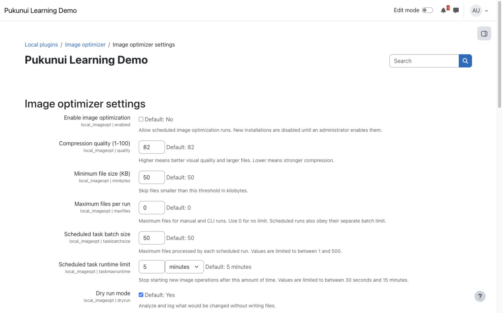
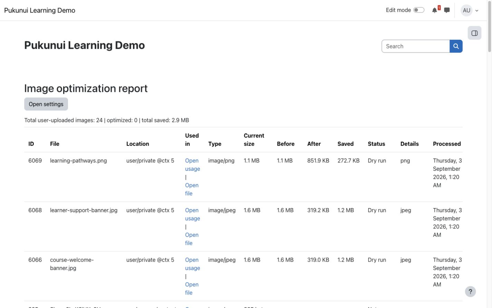
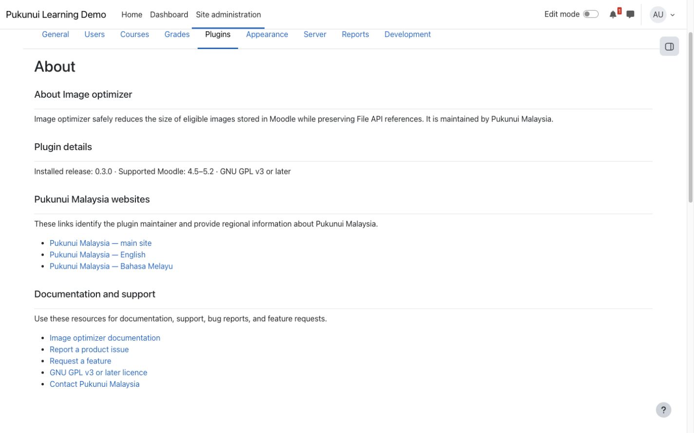

# Image optimizer

Image optimizer reduces the storage used by eligible existing JPEG and PNG files in Moodle's File API. It gives site administrators a safety-first batch workflow with dry-run analysis, bounded scheduled runs, a supported command-line runner, and an administrative report while keeping Moodle file references stable.

## Key features

- Discover eligible user-uploaded JPEG and PNG files while excluding transient drafts, generated assets, and known non-target file areas.
- Start new installations disabled and in dry-run mode so administrators can review results before allowing file changes.
- Keep Moodle File API references and file URLs stable when an image is replaced with its optimized version.
- Review current size, estimated or completed savings, status, and bounded processing details in an administrator-only report.
- Control image quality, minimum file size, manual-run limits, scheduled batch size, scheduled runtime, large-image resizing, and EXIF preservation.
- Prevent concurrent manual, scheduled, and command-line runs with Moodle's Lock API.
- Avoid repeatedly processing unchanged dry-run, incompressible, invalid, or failed files while automatically reconsidering files or output settings that change.
- Process JPEG and PNG images with PHP GD, with optional Imagick support for JPEG optimization when it is available.

## Screenshots

### Safe default settings

*New installations start disabled and in dry-run mode. All site names, files, and content shown are fictional demonstration data.*

### Optimization report

*The administrator report shows eligible files, size estimates, status, and processing details without changing files during a dry run. All site names, files, and content shown are fictional demonstration data.*

### About page

*The About page derives installed release and Moodle compatibility details from the plugin metadata and provides maintained documentation and support links. All site names and content shown are fictional demonstration data.*

## Requirements

- Moodle 4.5 through Moodle 5.2.
- PHP GD for image processing.
- Moodle cron configured for scheduled execution.
- Imagick is optional and is used for JPEG optimization when available.
- No external service or additional Moodle plugin is required.

One Image optimizer release package supports the full Moodle 4.5–5.2 range. Confirm compatibility before upgrading Moodle beyond that published range.

## Installation

Marketplace publication is pending. If Pukunui has provided the pre-release Image optimizer ZIP, open **Site administration > Plugins > Install plugins**, upload the ZIP, complete validation, and follow the displayed upgrade steps.

## Configuration and use

### Review the safety defaults

Open **Site administration > Plugins > Local plugins > Image optimizer > Image optimizer settings**. New installations have **Enable image optimization** switched off and **Dry run mode** switched on. Leave dry-run mode enabled for the first scan, review the report, and allow real writes only after the selected files and estimated savings are appropriate for the site.

### Configure image processing

Set the compression quality and minimum eligible file size. Optionally limit the number of files in manual and command-line runs, resize images larger than 1024 by 1024 pixels, or preserve JPEG EXIF metadata. Lower quality values usually create smaller files; preserving metadata can make output larger.

Image optimizer works only on eligible existing files. It excludes directories, transient draft files, core and theme assets, question content, known generated file areas, and files already marked as optimized by the plugin.

### Run and review a scan

Use **Run now** from the settings page for an immediate administrator-controlled scan, or open **Image optimization report** to review the current candidate and processing ledger. Manual, scheduled, and supported command-line runs use the same optimization manager, safety filters, and global lock.

### Configure scheduled execution

The scheduled task runs hourly at a randomised minute by default. The scheduled batch-size and runtime settings limit the work started by each task execution. Confirm that Moodle cron runs regularly, then enable optimization only when the site's dry-run results have been reviewed.

## Privacy and permissions

Only users with Moodle's site-configuration capability can view settings, run an immediate scan, or open the report. Image optimizer processes eligible images already stored in Moodle's File API and sends no image content or personal data to an external service.

The plugin stores operational statistics linked to Moodle File API records. Its Privacy API provider supports discovery, export, and deletion of those statistics. Privacy deletion removes Image optimizer statistics only; the original file remains governed by the Moodle component that owns it.

## Troubleshooting

- If no files are scanned, confirm that PHP GD is available and that images meet the configured size and eligibility rules.
- If scheduled optimization does not run, confirm that the plugin is enabled, Moodle cron is active, and the **Run image optimization batch** task is enabled.
- If an unchanged file is not retried, modify the file or an output-affecting setting to make it eligible for reconsideration.
- A **Can't compress** result means the generated image was not smaller than the original under the selected settings.
- An **Invalid image** result means the source could not be decoded as an eligible image; the run continues with later files.
- If a run reports that another run is in progress, wait for the current manual, scheduled, or command-line run to finish before retrying.
- If recent settings or report changes are not visible, purge Moodle caches and reload the administration page.

## Support and licence

- [Report an Image optimizer product issue](https://github.com/PukunuiMalaysia/moodle-docs/issues/new?template=product-bug.yml)
- [Request an Image optimizer feature](https://github.com/PukunuiMalaysia/moodle-docs/issues/new?template=feature.yml)
- [Report a documentation issue](https://github.com/PukunuiMalaysia/moodle-docs/issues/new?template=documentation.yml)
- [Pukunui Plugin Subscription Terms & Support Policy](https://pukunui.com/docs/policy-moodle-marketplace/)
- [Pukunui Malaysia support](https://pukunui.com/location/malaysia/)

Image optimizer is licensed under the GNU General Public License v3 or later. This documentation is licensed under [CC BY 4.0](https://creativecommons.org/licenses/by/4.0/).
