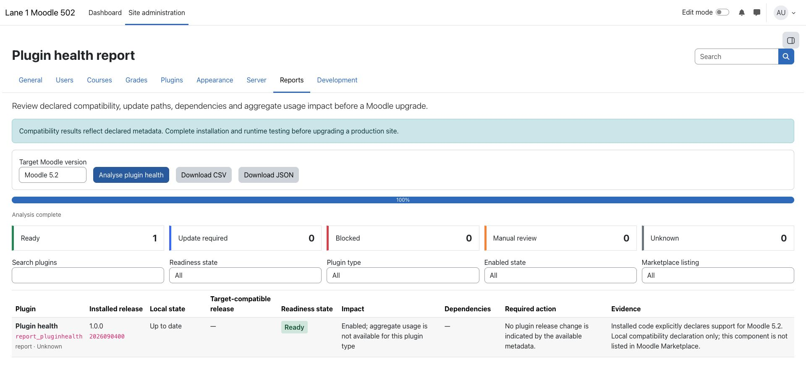
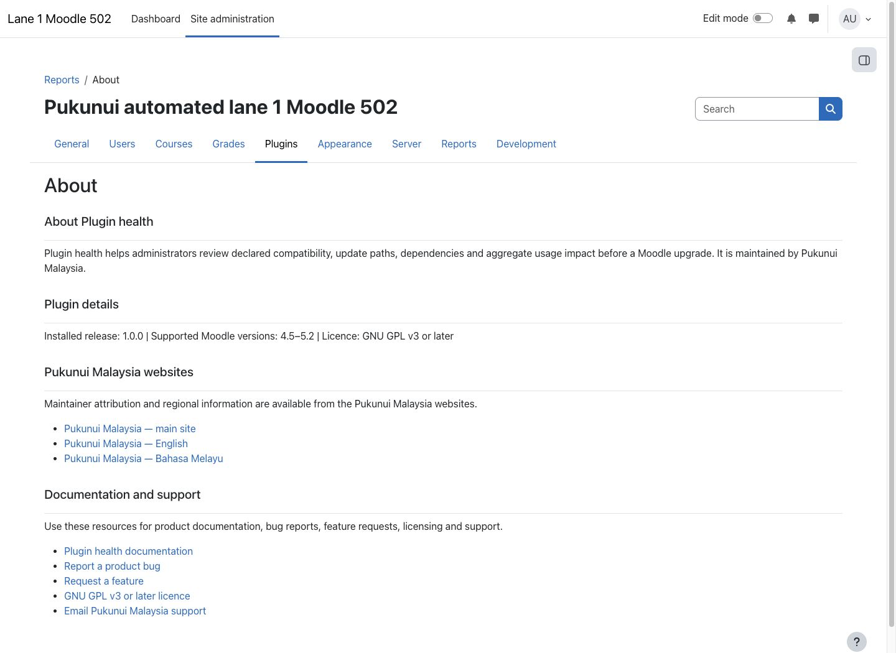

# Plugin health

Plugin health helps Moodle administrators plan upgrades by combining installed plugin declarations with public release metadata from Moodle's official plugin information service. It shows likely upgrade actions for third-party plugins without downloading, installing, or changing them.

Compatibility results describe declared metadata, not runtime certification. Always test the selected plugins together in a staging environment before upgrading a production site.

## Key features

- Inventory installed third-party plugins using Moodle's plugin manager.
- Compare the exact installed release and the best available release with a selected Moodle target.
- Distinguish **Ready**, **Update required**, **Blocked**, **Manual review**, and **Unknown** results, with supporting evidence and suggested actions.
- Show local code and database state, requirements, dependencies, and reverse dependencies.
- Add aggregate usage counts for activities, blocks, question types, course formats, and enrolment methods.
- Load external results progressively and cache responses to reduce repeat requests.
- Export complete CSV and JSON action registers for upgrade planning.
- Handle custom plugins, missing listings, paid listings, rate limits, and external-service outages without treating missing information as proof of incompatibility.

## Screenshots

### Upgrade-readiness report

*The report combines local declarations with available release evidence. Results are planning guidance, not a guarantee of runtime compatibility. All site names and content shown are fictional demonstration data.*

### Administrator About page

*The static About page derives the release and compatibility range from installed plugin metadata and provides documentation and support links. All site names and content shown are fictional demonstration data.*

## Requirements

- Moodle 4.5 through Moodle 5.2.
- PHP and database versions supported by the selected Moodle release.
- Outbound HTTPS access to `download.moodle.org` for external release metadata.
- No additional Moodle plugin, service account, API credential, or paid service is required.

One release package supports the full Moodle 4.5–5.2 range. Confirm compatibility before upgrading beyond that published range.

## Installation

Marketplace publication is pending. If Pukunui has provided the pre-release Plugin health ZIP, open **Site administration > Plugins > Install plugins**, upload the ZIP, complete validation, and follow the displayed upgrade steps.

No separate dependency installation or command-line setup is required. The report does not create its own database tables or scheduled tasks.

## Configuration and use

### Analyse installed plugins

Open **Site administration > Reports > Plugin health**, select the target Moodle version, and choose **Analyse plugin health**. The local inventory is available immediately; external results appear progressively. Review each plugin's evidence, dependency information, usage impact, and required action.

### Interpret results

- **Ready:** the installed code or exact release declares support for the target, and local dependencies pass.
- **Update required:** a newer target-compatible release is available.
- **Blocked:** local plugin state or a dependency is invalid, or a listed plugin has no target-compatible release.
- **Manual review:** declarations conflict, or a custom or unlisted plugin has insufficient decisive local metadata.
- **Unknown:** remote metadata is unavailable and local declarations are inconclusive.

A custom or unlisted plugin can be **Ready** when its installed declarations explicitly support the target. The report marks that evidence as local-only. Aggregate usage counts help prioritise review but do not establish how important a plugin is to a particular course or organisation.

### Export an action register

Use **Download CSV** or **Download JSON** to obtain a complete target report for review. These exports contain plugin metadata and aggregate impact counts, not personal records or package download URLs. Treat the export as a planning snapshot and repeat the analysis after changing installed plugins.

### View plugin information

Open **Site administration > Plugins > Reports > About** for the installed release, supported Moodle range, licence, maintainer websites, and documentation and support links. The page is headed **About Plugin health**. It is informational only; Plugin health has no configurable settings.

## Privacy and permissions

The report and exports require the system capability `report/pluginhealth:view`, granted to managers by default. The About page requires Moodle's site-configuration capability. Learners and other users without the report capability cannot access the report or its exports.

Plugin health stores no personal data. It reads aggregate usage counts through Moodle's database API and does not display or export individual user records. Its Privacy API provider declares that no personal data is stored and describes the external metadata lookup.

External requests send plugin component names, installed version numbers, and the selected Moodle target to Moodle's public metadata service. Moodle's configured proxy is respected, TLS certificates are verified, and responses are cached. No credentials are required. If the service is unavailable, local evidence remains available and inconclusive results are reported explicitly.

The plugin does not purchase, download, install, or update Marketplace packages. Paid and free listings are used only as metadata.

## Troubleshooting

- If the report is unavailable, check the user's system-level `report/pluginhealth:view` capability.
- If a plugin is **Unknown**, verify outbound HTTPS access and Moodle proxy settings, then retry after the temporary failure cache expires.
- If a custom plugin requires **Manual review**, check its installed version declarations and ask its maintainer for target-version support evidence.
- If a plugin is **Blocked**, inspect its local code/database state and dependency details before choosing an upgrade action.
- If declarations conflict, do not treat a Marketplace listing alone as proof that the installed code is compatible.
- Successful and missing-listing responses are cached for up to one day; temporary failures are cached for five minutes. A site administrator can purge Moodle caches when an immediate refresh is necessary.
- If exports or analysis appear incomplete, reload the report and repeat the analysis; the plugin makes no installation changes that need to be rolled back.

## Support and licence

- [Report a Plugin health product issue](https://github.com/PukunuiMalaysia/moodle-docs/issues/new?template=product-bug.yml)
- [Request a Plugin health feature](https://github.com/PukunuiMalaysia/moodle-docs/issues/new?template=feature.yml)
- [Report a documentation issue](https://github.com/PukunuiMalaysia/moodle-docs/issues/new?template=documentation.yml)
- [Pukunui Malaysia support](https://pukunui.com/location/malaysia/)
- [Email Pukunui Malaysia](mailto:hello.my@pukunui.com)

Plugin health is licensed under the [GNU General Public License v3 or later](https://www.gnu.org/licenses/gpl-3.0.html). This documentation is licensed under [CC BY 4.0](https://creativecommons.org/licenses/by/4.0/).
