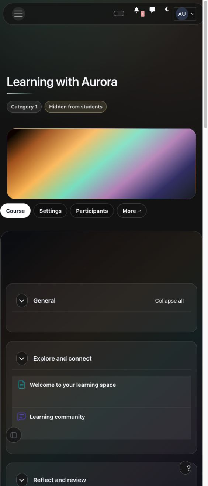
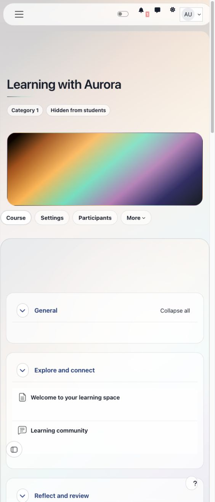
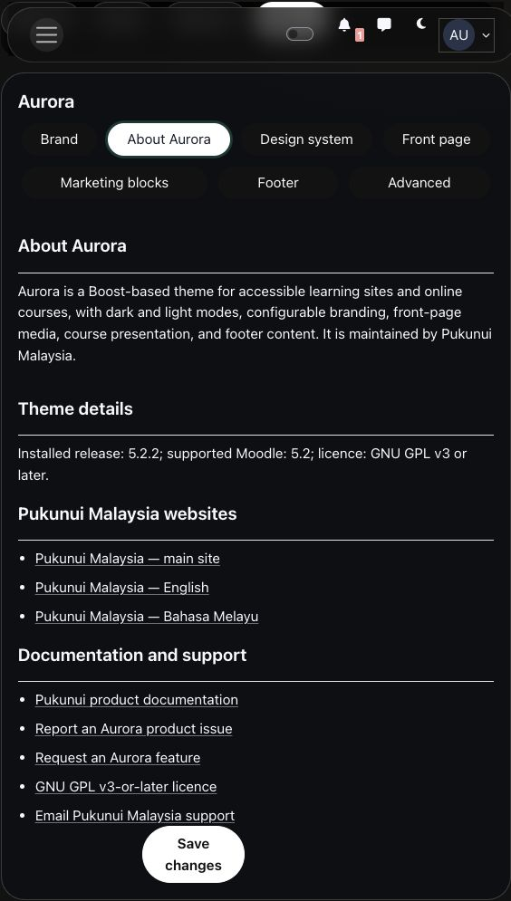

# Aurora

Aurora is a Boost child theme for learning sites and online courses. It combines coordinated dark and light modes, configurable branding, front-page media, course presentation, and a structured footer while retaining Moodle's standard navigation and learning activities. It is maintained by Pukunui Malaysia.

## Key features

- Let learners switch between dark and light modes from the navigation bar.
- Configure separate logos for each mode, a fallback logo, and a favicon.
- Choose colours, a background gradient, font pairings, spacing density, and course-card presentation.
- Add a front-page image or decorative background video with a keyboard-accessible play/pause control.
- Configure learning-focused content cards, course-header options, and course-image fallbacks.
- Provide institutional footer navigation, contact information, social links, and optional mobile-app links.
- Review installed release, compatibility, licence, maintainer information, and support links in the About Aurora settings tab.

## Screenshots

These captures show Aurora 5.2.2 on Moodle 5.2 at a narrow browser width, using a configured course-header gradient. All people and content shown are fictional demonstration data.

*Dark mode keeps the course heading, navigation, sections, and activity links readable on a narrow screen.*

*Light mode uses the same course structure and configured gradient with a coordinated light palette.*

*The informational About tab presents installed metadata and public support links within standard site administration.*

## Requirements

Aurora currently has separate release packages for these Moodle lines:

- Aurora 4.5.3: Moodle 4.5 LTS.
- Aurora 5.0.1: Moodle 5.0.
- Aurora 5.1.2: Moodle 5.1.
- Aurora 5.2.2: Moodle 5.2.

Choose the package for the Moodle line used by your site. Moodle versions earlier than 4.5 and Moodle 5.3 or later are not supported.

Aurora requires the Boost theme supplied with Moodle and the PHP and browser versions supported by the selected Moodle line. No additional Moodle plugin, external service, or post-installation build step is required.

## Installation

Marketplace publication is pending. If Pukunui has provided a pre-release Aurora ZIP, open **Site administration > Plugins > Install plugins**, upload the matching package, complete validation, and follow Moodle's installation instructions. Select **Aurora** on the theme selection page under **Site administration > Appearance**.

Back up the site before an upgrade. When upgrading Moodle to another supported line, use the corresponding Aurora package and complete Moodle's upgrade process. Purge caches after changing the theme or its appearance settings.

## Configuration and use

Open **Site administration > Appearance > Custom theme settings > Aurora**. Only authorised site administrators can change these settings.

### Branding and design

Use **Brand** to upload light-mode and dark-mode logos, a fallback logo, and a favicon. Check each logo against its actual background in both modes.

Under **Design system**, choose the default colour mode, colours, gradient, font pairing, density, course-card style, login treatment, and course-header options. **Load Google Fonts** is disabled by default. Without it, the chosen font families use locally available fonts and system fallbacks.

Signed-in users can activate **Toggle colour mode** with a pointer, Enter, or Space. Their choice is stored as a Moodle user preference and applies to their own presentation. Guest choices are stored in the current browser when browser storage is available.

### Front page and content cards

Use **Front page** to configure the hero media. Uploaded media is served through Moodle's File API. Keep essential information in page text, not only in a background image or video.

Decorative hero videos are muted and provide a play/pause control. They do not start automatically when the visitor requests reduced motion. Without JavaScript, the background remains still.

Use **Marketing blocks** for the site's configurable content cards. The shipped defaults use learning-focused language, such as finding courses and following learning pathways. Replace their text, images, and destinations with information appropriate to your institution.

### Footer and advanced styling

Use **Footer** for institutional navigation, support and contact details, social links, legal links, mobile-app links, and optional custom content. Verify that destinations are accessible to the intended visitors.

Use **Advanced** for small site-specific SCSS additions. Custom styles can override Aurora's defaults; check affected pages, drawers, dialogs, and activity controls in both modes after saving changes.

### About Aurora

The **About Aurora** tab is informational. It displays the installed release, supported Moodle line, GNU GPL v3-or-later licence, Pukunui Malaysia maintainer websites, documentation, issue and feature forms, and support contact. It does not create configuration records or send analytics.

### Accessibility

Aurora's default palettes are designed for WCAG 2.2 AA text contrast and visible keyboard focus. Colour-mode controls include accessible labels and state, content links use non-colour cues where needed, and decorative video respects reduced-motion preferences.

Theme defaults alone do not establish compliance for an entire learning site. Uploaded media, custom colours and SCSS, third-party plugins, and authored course content can affect accessibility. Test the login page, navigation, course pages, quizzes, assignments, gradebook, settings, drawers, and dialogs in both modes. Include keyboard-only use, screen-reader checks, 200% zoom, and narrow-screen reflow before production use.

## Privacy and permissions

Aurora stores site-level theme settings and uploaded media using Moodle's configuration and File APIs. A signed-in user's colour-mode choice is stored through Moodle's user-preference API. Aurora's Privacy API provider declares and exports that preference. Guest browser-storage choices are not stored as a Moodle account preference.

Remote Google Fonts are optional and disabled by default. When disabled, Aurora does not request fonts from Google. If an administrator enables them, visitors' browsers contact Google Fonts and share their IP addresses and standard browser request information. No credentials are required. If remote fonts are unavailable, local fonts and system fallbacks remain available. Review the site's privacy obligations before enabling this option.

Aurora does not include analytics, tracking, payment flows, or a required external service. The About tab adds no personal-data processing. Moodle's normal roles and capabilities continue to control access to courses, activities, reports, administration, and editing features.

## Troubleshooting

- If a change is not visible, confirm that Aurora is selected and purge Moodle caches.
- If a logo or hero image is missing, reopen the relevant setting, confirm that the upload was saved, and check the file type permitted by the field.
- If a font pairing looks different between devices, check **Load Google Fonts** and whether the selected fonts are installed locally. Fonts are not downloaded from Google while that option is disabled.
- If a colour-mode choice does not persist for a guest, check whether browser storage is blocked or cleared. Signed-in preferences use the Moodle account instead.
- If video is paused on page load, check the visitor's reduced-motion preference and the browser's media-playback policy. The play/pause control remains available when JavaScript is enabled.
- If text, icons, or controls are difficult to read, test Aurora's default colours without custom SCSS, then inspect the affected page in both modes.
- If navigation or editing controls overlap, remove site-specific style overrides and check the relevant third-party plugin with the site's supported Moodle and Aurora versions.
- Before uninstalling Aurora, select another available theme and back up settings or media you want to retain. Use Moodle's normal plugin-management workflow to uninstall it.

## Support and licence

- [Report an Aurora product issue](https://github.com/PukunuiMalaysia/moodle-docs/issues/new?template=product-bug.yml)
- [Request an Aurora feature](https://github.com/PukunuiMalaysia/moodle-docs/issues/new?template=feature.yml)
- [Report a documentation issue](https://github.com/PukunuiMalaysia/moodle-docs/issues/new?template=documentation.yml)
- [Email Pukunui Malaysia support](mailto:hello.my@pukunui.com)
- [Pukunui Malaysia support website](https://pukunui.com/location/malaysia/)
- [GNU General Public License v3 or later](https://www.gnu.org/licenses/gpl-3.0.html)

Aurora is licensed under GNU GPL v3 or later. This documentation is licensed under [CC BY 4.0](https://creativecommons.org/licenses/by/4.0/).
