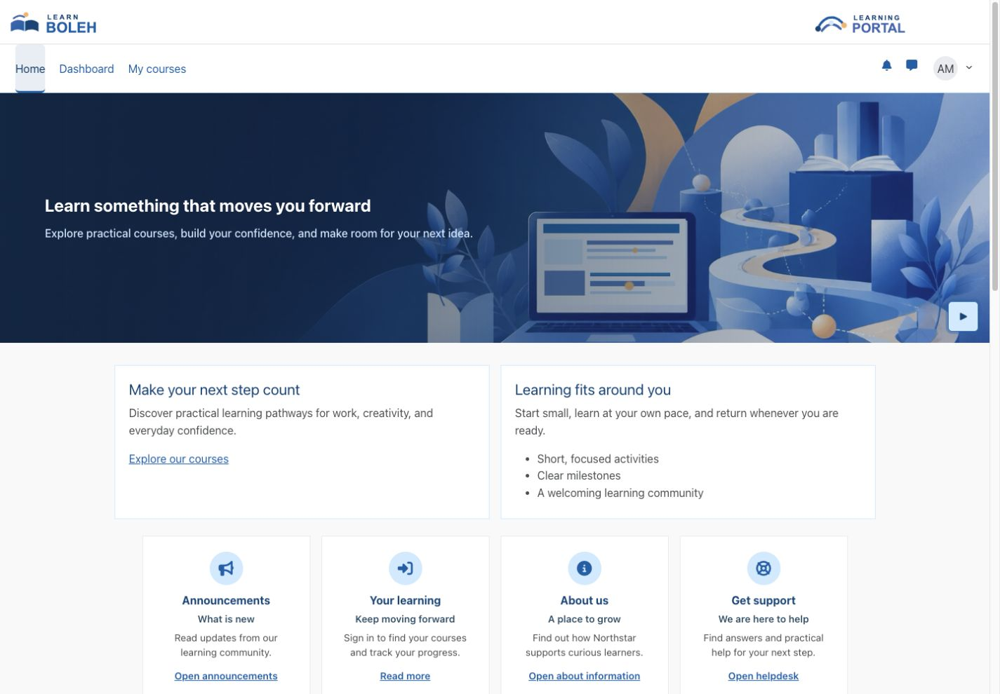
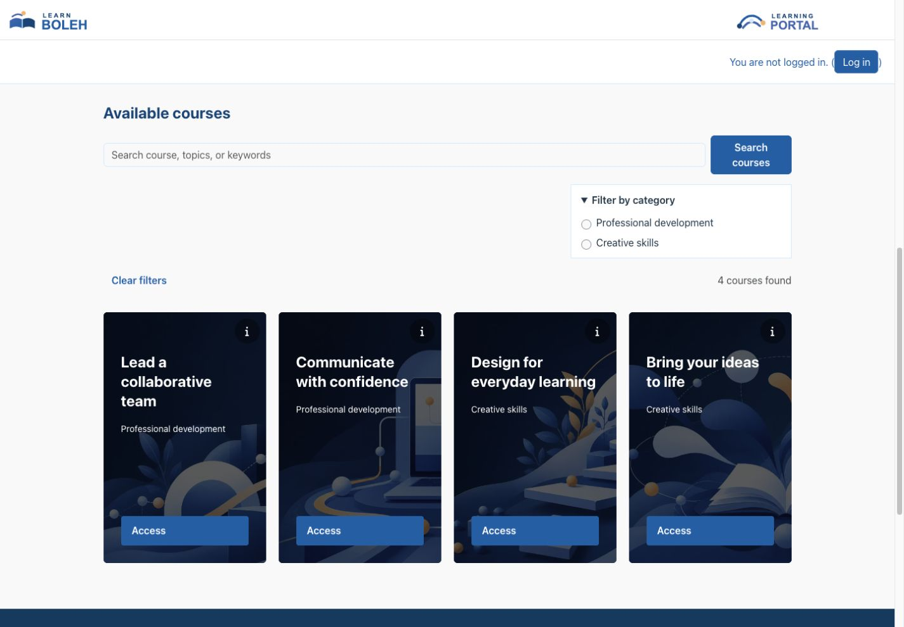
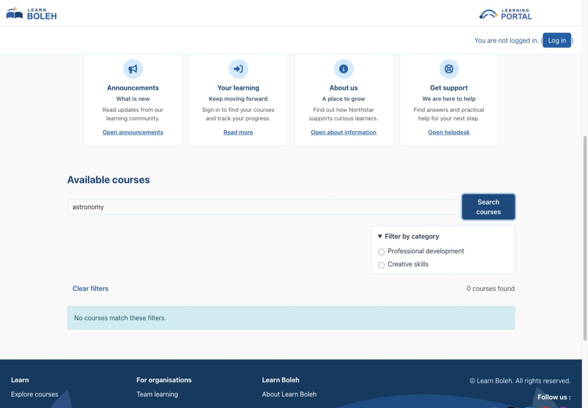
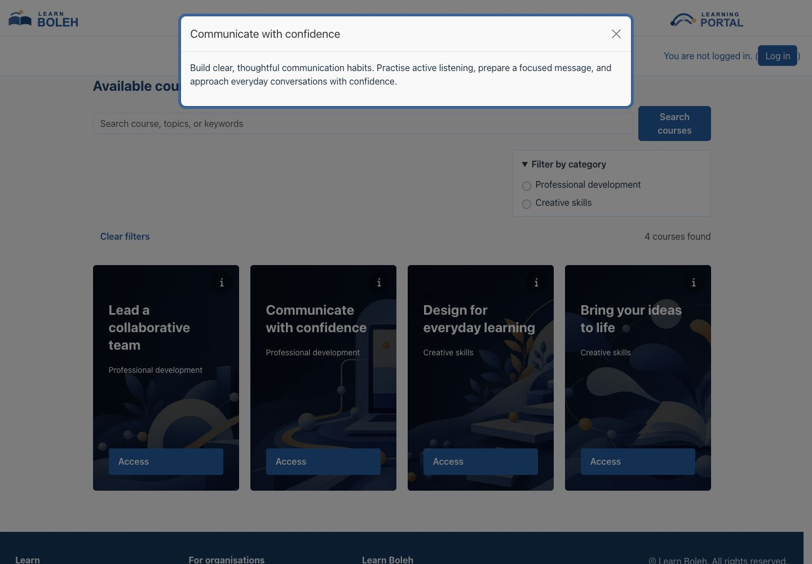
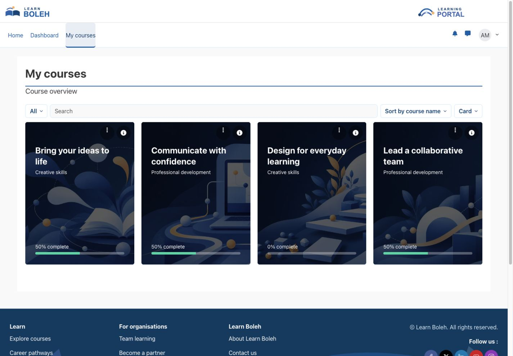
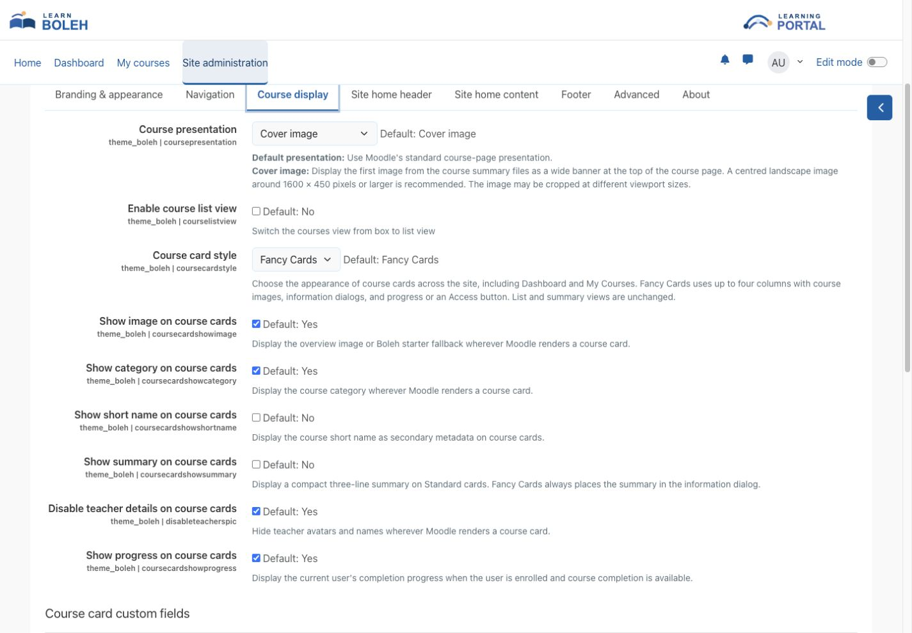
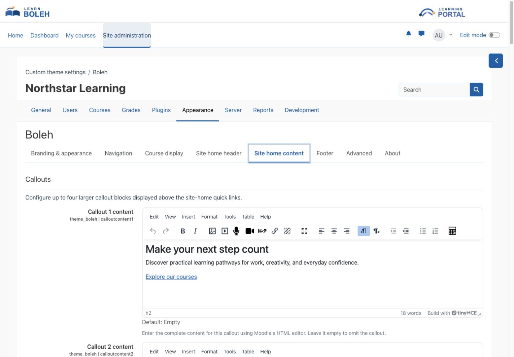
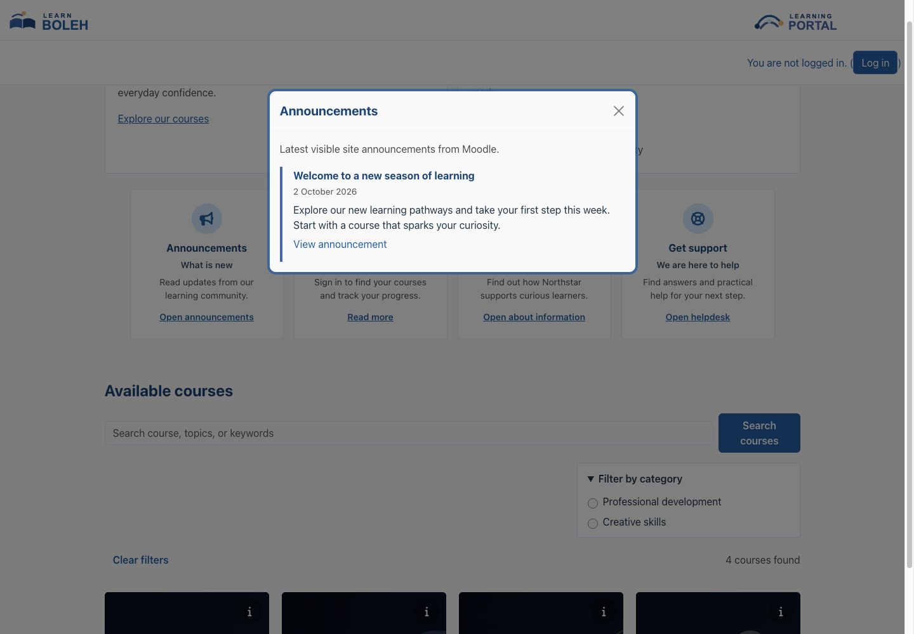
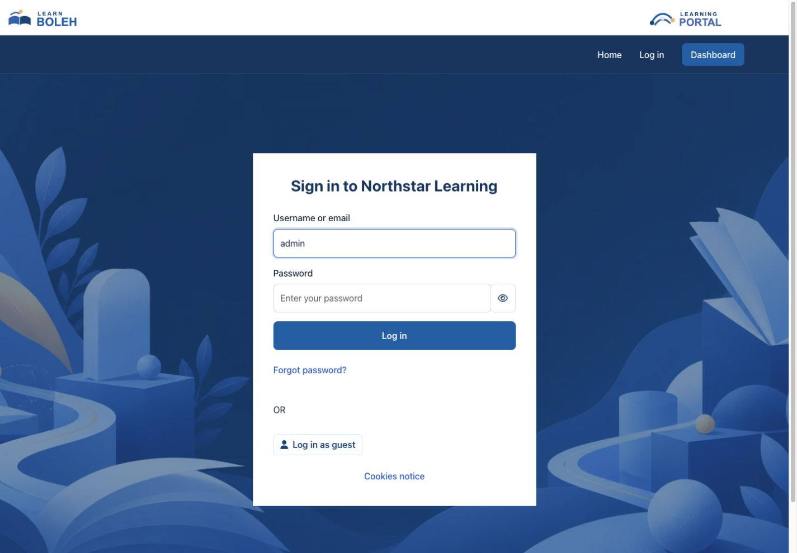
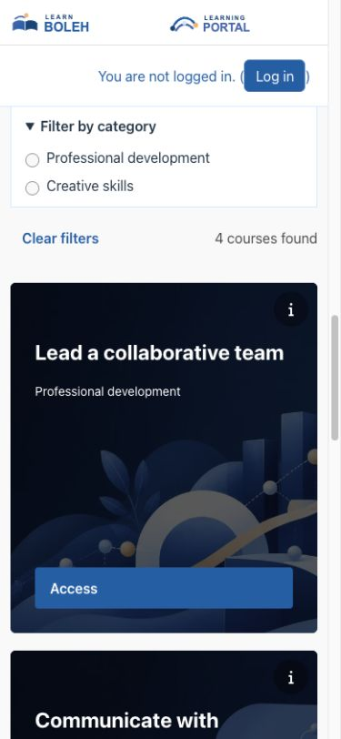

# Boleh

Boleh is a Boost-based Moodle theme for organisations that want a clean, branded learning experience without replacing Moodle's standard navigation and course workflows. It combines configurable branding, a video-led site home, site-wide Fancy Cards, rich-text callouts, accessibility preferences, and responsive layouts in one theme.

## Key features

- Configure organisation and learning-platform logos, colours, typography, spacing density, favicon, and optional dual-brand mastheads.
- Use the bundled site-home video and poster, or replace them with an administrator-uploaded image or MP4 video.
- Build a branded site home with banner content, up to four rich-text callout blocks, three to five quick-link cards, and announcements.
- Choose Standard cards or Fancy Cards across site home, the course catalogue, Dashboard, My courses, and starred or recently accessed course blocks.
- Open course-information dialogs from Fancy Cards; show optional category, short name, teacher details, custom fields, and learner progress.
- Add category filters and course search to the site-home course sections, while respecting Moodle course visibility.
- Use Moodle course overview images, stable bundled fallback media, and optional course-page covers.
- Choose a light or dark navbar treatment while retaining Moodle's primary navigation, user menu, messages, notifications, edit switch, course index, and drawers.
- Give users presentation preferences for toolbar visibility, font size, colour mode, and a dyslexia-friendly font.
- Apply responsive Boleh styling to the login page, dashboard, courses, activities, reports, administration pages, and footer.

## Screenshots

These screenshots show Boleh 5.10.0 on Moodle 5.2. All people, courses, organisations, and content shown are fictional demonstration data.

### Site home and callouts

*Callouts sit above the quick links. Each block can contain its own headings, paragraphs, lists, links, and uploaded media.*

### Fancy Cards and course filters

*Fancy Cards use up to four columns when space permits, with course titles, category labels, information buttons, and course access controls.*

### Empty filter results

*An empty result is explained in place; visitors can clear their filters and continue browsing.*

### Course information

*The information button opens the course summary without leaving the course list. Configured teacher details and visible custom fields can also appear here.*

### My courses

*The same card style follows learners into My courses, preserving Moodle's search, filters, course menus, and completion progress where available.*

### Configure course cards

*Administrators select the card style and choose which course information to show.*

### Edit callout content

*Each callout uses Moodle's editor, including its image and media tools. Leave an editor empty to omit that callout.*

### Announcements

*The announcements quick link opens site announcements without leaving the home page.*

### Login page

*The login page preserves Moodle's normal sign-in workflow and supports a configurable background and login-box position.*

### Mobile callouts

*The callouts stack in their configured order and retain headings, links, and list formatting on a phone-sized viewport.*

### Mobile course cards

*Cards adapt to a narrow viewport while keeping titles, information buttons, and course access available.*

## Requirements

- Moodle 4.5 LTS through Moodle 5.2.
- Moodle's Boost theme, which is included with Moodle.
- A modern supported browser.
- No additional Moodle plugin or external service is required for normal operation.

One current Boleh release package supports the full Moodle 4.5–5.2 range. Keep Boleh updated when upgrading Moodle, and confirm compatibility before moving beyond that published range.

## Installation

[Get Boleh from Moodle Marketplace](https://marketplace.moodle.com/plugins/theme_boleh). After downloading the installation ZIP, open **Site administration > Plugins > Install plugins**, upload the ZIP, complete validation, and follow the displayed upgrade steps. Then open **Site administration > Appearance > Theme selector** and select **Boleh**.

## Configuration and use

### Choose branding and appearance

Open **Boleh** in the theme settings under **Site administration > Appearance**. Under **Branding & appearance**, configure the organisation logo, optional learning-platform logo, masthead background, favicon, colour palette, body and heading fonts, and spacing preset. When a learning-platform logo is present, Boleh displays a dual-brand masthead while keeping both logo aspect ratios intact.

Fresh installations can use Boleh's bundled starter media. Administrator uploads take precedence over bundled logos and imagery. Disable **Use bundled starter media** if the site should use colour fallbacks until custom media is supplied.

### Configure navigation and course pages

Under **Navigation**, choose the light or dark navbar treatment and its colours. You can enable **Back to course** on activity pages and optionally show classic breadcrumbs. Moodle's course index and drawers remain available.

Under **Course display**, the course presentation setting controls the course-page cover. This is separate from **Course card style**, which controls cards in course lists.

### Choose Standard cards or Fancy Cards

1. Open **Boleh** under **Site administration > Appearance**, then select **Course display**.
2. Set **Course card style** to **Standard** or **Fancy Cards** and save the changes.
3. Check site home, the course catalogue, and **My courses** using its **Card** display option.

Fresh installations default to Fancy Cards. When upgrading an older installation without a saved card-style choice, Boleh retains Standard cards. Select Fancy Cards explicitly to change that site's appearance; an existing saved choice is preserved.

Fancy Cards use image backgrounds, an overlay for readable titles, and up to four columns where space permits. They also apply to course search and category pages, Dashboard course cards, and starred and recently accessed course blocks. Moodle's **List** and **Summary** display options keep their normal layouts.

Select a course title or **Access** button to follow Moodle's normal course-access workflow. The information button opens a dialog with the course summary and any enabled teacher details or selected custom fields the viewer may see. Press **Escape** or use the close button to return to the cards. If no details are available, the dialog says so.

Use the settings on the same page to control the card content:

| Setting | Behaviour |
| --- | --- |
| **Show image on course cards** | Show the course overview image or Boleh fallback. Turning this off gives Fancy Cards a solid-colour appearance. |
| **Show category on course cards** | Show the course's category. |
| **Show short name on course cards** | Add the course short name as secondary information. |
| **Show summary on course cards** | Show a compact, three-line summary on Standard cards. Fancy Cards place the summary in the information dialog regardless of this setting. |
| **Disable teacher details on course cards** | Hide teacher details when enabled. When disabled, configured course contacts can appear; Fancy Cards place them in the information dialog. |
| **Show progress on course cards** | Show the signed-in learner's completion progress when they are enrolled and course completion is available. Fancy Cards use progress in place of the Access button when progress is shown. The course title still opens the course. |
| **Course card custom fields** | Select fields for display. Moodle's field visibility rules still apply; Fancy Cards show these fields in the information dialog. |

If no course custom fields exist, Boleh displays an explanatory message instead of an empty selection. Create the fields in Moodle's course custom-field administration first, then return to choose them.

A Moodle course overview image takes precedence over bundled imagery. With starter media enabled, courses without an overview image use one of six bundled fallback images selected consistently for each course. Card images and course-page covers are separate presentation settings.

### Add site-home course filters

Under **Course display**, enable **Enable front-page course filters** and choose the category trees in **Front-page filter categories**. Moodle's site-home settings must include **Available courses** or **Enrolled courses** for the corresponding course section to appear.

Visitors can search courses, narrow the results by category, and use **Clear filters** to return to the unfiltered view. These controls respect the viewer's Moodle permissions and do not grant access to hidden courses. A search with no matching courses shows an empty-results message.

### Build the site home

Use **Site home header** to upload a header image or MP4 video and set the banner heading, content, and colours. In **Site home content**, configure the larger callouts first, followed by the quick-link cards and announcements.

Guests and signed-in users share the configured header, banner, callouts, and optional quick links. Signed-in users retain Moodle's navigation and editing controls. These home-page sections do not appear on Dashboard or course pages.

#### Add callout blocks

1. Open **Site home content** and find **Callouts**.
2. Enter content in **Callout 1 content** through **Callout 4 content**. Each editor holds the complete block, including its heading if wanted.
3. Use Moodle's editor to format headings, paragraphs, lists, and links. Use its image or media tools and file picker to upload files into the callout.
4. Save the changes and check the site home as a guest and a signed-in user, including a narrow screen.

Boleh displays only non-empty callouts, in numerical order, above the quick links. Leave a callout empty to omit it. These are theme-managed site-home sections configured by an administrator; they are not blocks added through Moodle's block drawer.

Keep content concise, use a logical heading order, give meaningful images alternative text, and avoid relying on colour alone. Callout content is visible to guests who can access the site home, so do not put confidential information or restricted learning materials there.

#### Configure quick-link cards and announcements

Under **Quick links**, choose whether to display the cards. **Marketing Count** selects three, four, or five cards; save that choice first to load the corresponding fields. For each card, configure its image or icon, heading, subheading, rich-text content, and destination. The **Marketing Content** editor supports formatted text and uploaded media, and links inside the content remain usable.

The bundled Announcements quick link can open the announcements dialog. Configure its enabled state and item limit in the announcements settings, and manage the actual announcements in Moodle's site announcements forum. The About us and Helpdesk quick links have their own home-page dialogs.

Older Boleh guides may mention sponsor and client logo rows. These sections have been removed. Use callouts or quick-link content for suitable public-facing information instead.

### Configure the login page

Choose the login background and **Login box position** under **Branding & appearance**. The box can sit on the left, in the centre, or on the right. **Extend to full-height side panel** applies to left- or right-aligned boxes on larger screens; phones use the centred layout.

### Review changes

After changing theme settings or media, purge Moodle caches and inspect the guest and signed-in site home, login page, dashboard, course and activity pages, administration pages, drawers, modals, and mobile layouts. Review custom styling in both navbar modes and with accessibility preferences enabled.

## Privacy and permissions

Boleh stores site-level theme configuration and user preferences for accessibility-toolbar visibility, font size, colour mode, and font type. Its Moodle Privacy API provider declares and exports those preferences. Boleh does not require an external service for normal operation and does not send these preferences outside Moodle.

Only authorised site administrators can change theme settings and uploaded media. Each user's accessibility preferences affect that user's presentation only. Normal Moodle roles and capabilities continue to control access to courses, activities, reports, administration, and editing features.

## Troubleshooting

- If a visual or media change is not visible, confirm that Boleh is the active theme and purge Moodle caches.
- If uploaded media is missing, reopen the relevant Boleh setting, confirm that the file was saved, and check that the browser can load it through Moodle's File API.
- If the bundled images appear unexpectedly, review **Use bundled starter media** and the relevant uploaded-media setting.
- If navigation or drawers overlap page content, temporarily remove custom styling and retest with Boleh's standard settings.
- If text or controls have poor contrast, review the selected navbar mode, configured colours, and enabled accessibility colour mode.
- If course cards show fallback images, add a Moodle course overview image where a course-specific image is required.
- If Fancy Cards do not appear after an upgrade, select **Fancy Cards** under **Course display** and save. In My courses, also select **Card** rather than List or Summary.
- If a Fancy Card does not show its summary, open its information button. The inline-summary setting applies only to Standard cards.
- If progress is missing, check enrolment, Moodle course-completion setup, and **Show progress on course cards**. Opening a course alone does not establish completion progress.
- If course details fail to load, use **Retry** in the dialog and check that the session and course access are still valid.
- If filters show no results, clear the search and category choices and check the viewer's permissions and course visibility.
- If a callout is missing, confirm that its editor contains content and that the changes were saved. Callouts appear on site home, above the quick links.
- If embedded media is missing, reopen the callout or quick-link editor and insert the file through Moodle's file picker. A file link copied from another editor's temporary draft area may not remain available.
- After a Moodle upgrade, install the latest compatible Boleh release, complete Moodle's upgrade process, and purge caches.

## Support and licence

- [Report a Boleh product issue](https://github.com/PukunuiMalaysia/moodle-docs/issues/new?template=product-bug.yml)
- [Request a Boleh feature](https://github.com/PukunuiMalaysia/moodle-docs/issues/new?template=feature.yml)
- [Report a documentation issue](https://github.com/PukunuiMalaysia/moodle-docs/issues/new?template=documentation.yml)
- [Pukunui Plugin Subscription Terms & Support Policy](https://pukunui.com/docs/policy-moodle-marketplace/)
- [Pukunui Malaysia support](https://pukunui.com/location/malaysia/)

Boleh is licensed under the GNU General Public License v3 or later. This documentation is licensed under [CC BY 4.0](https://creativecommons.org/licenses/by/4.0/).
