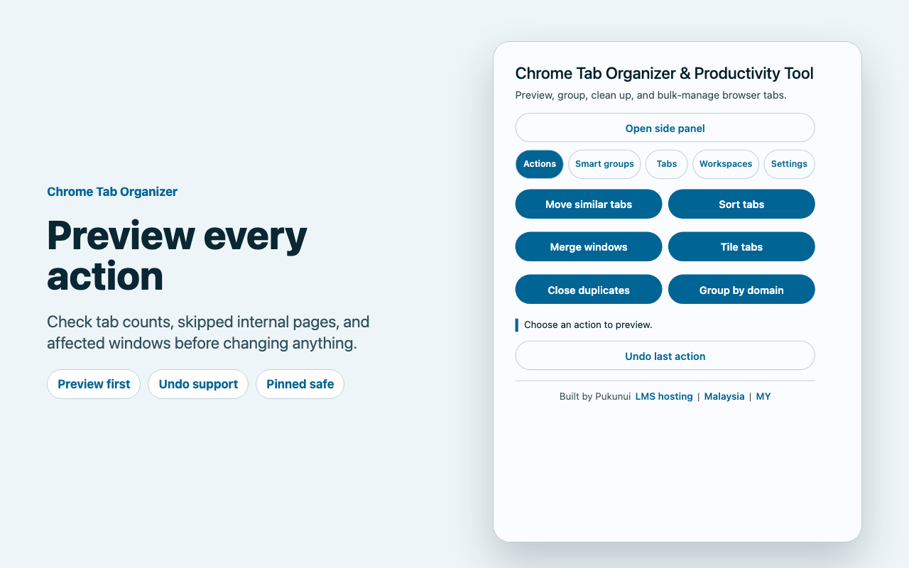
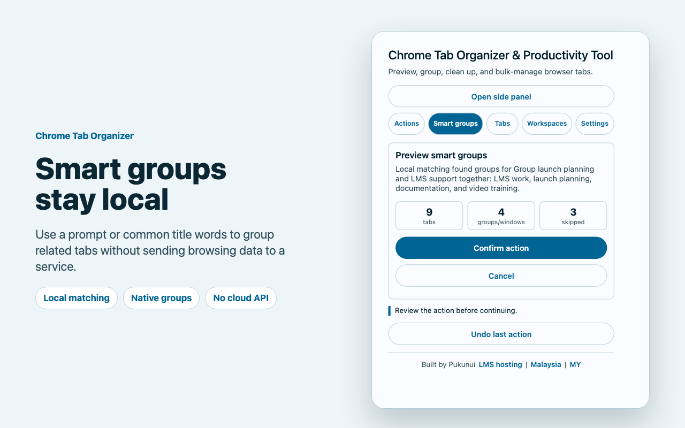
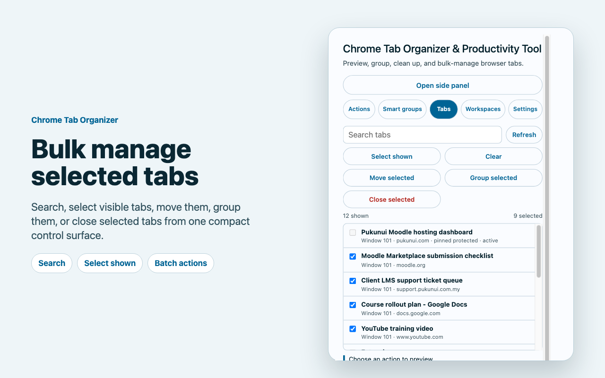
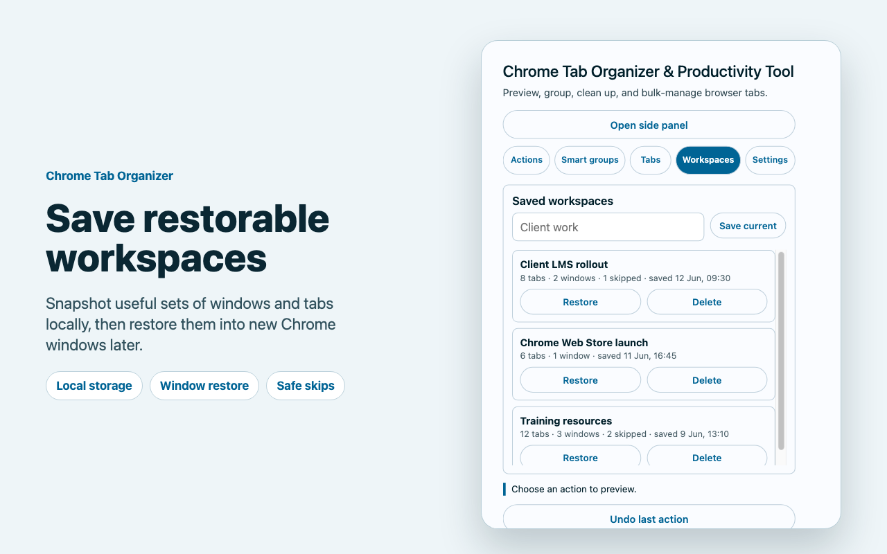
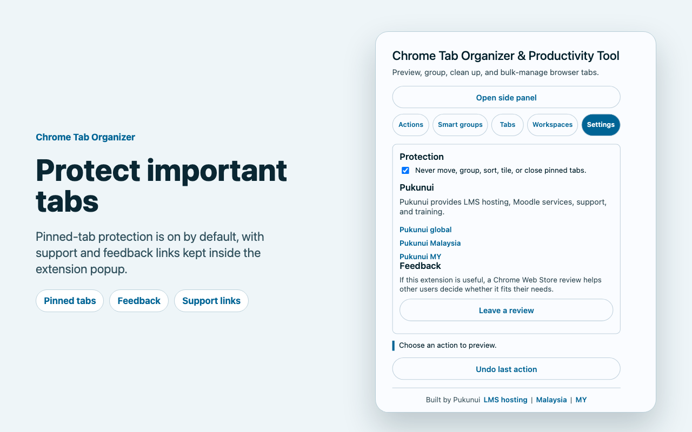
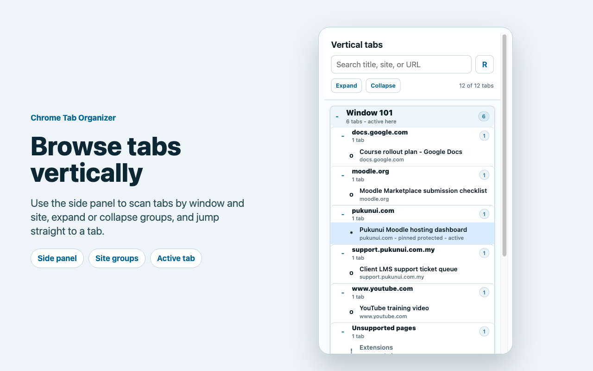

# Chrome Tab Organizer & Productivity Tool

Chrome Tab Organizer & Productivity Tool helps Chrome users control large tab sessions with previews, local smart grouping, reusable workspaces, bulk actions, and a searchable vertical side panel.

## Key features

- Preview tab-moving, grouping, tiling, sorting, and closing actions before they run where practical.
- Create local smart groups from tab titles, URLs, hostnames, and an optional intent prompt.
- Save restorable workspaces without replacing or closing the current session.
- Search and focus tabs from a vertical side panel grouped by window and domain.
- Protect pinned tabs and skip unsupported Chrome or extension pages safely.
- Keep settings, workspaces, and processing on the user's device.

## Screenshots

### Action overview

*The popup keeps the main tab actions together and previews affected tabs. All tabs and sites shown are fictional demonstration data.*

### Smart groups

*Smart Groups proposes local groupings before applying them. All tabs and sites shown are fictional demonstration data.*

### Bulk tab management

*Bulk controls report the scope of each action before it runs. All tabs and sites shown are fictional demonstration data.*

### Saved workspaces

*Workspaces preserve restorable web tabs and window organisation locally. All tabs and sites shown are fictional demonstration data.*

### Protection and feedback

*Protection settings and status messages make skipped tabs visible. All tabs and sites shown are fictional demonstration data.*

### Vertical side panel

*The side panel provides a searchable vertical view across Chrome windows. All tabs and sites shown are fictional demonstration data.*

## Requirements

- A current version of Google Chrome with Manifest V3, native tab groups, and side-panel support.
- Permission to manage tabs, windows, tab groups, local storage, displays, the side panel, and the confirmed page action used by tiling.
- No account, external service, or remote AI service is required.

## Installation

Install [Chrome Tab Organizer & Productivity Tool](https://chromewebstore.google.com/detail/chrome-tab-organizer-prod/npiekcbklimcbgghdlomjmenhobmlbea) from the Chrome Web Store, then pin it to the Chrome toolbar if frequent popup access is useful. Select **Open side panel** in the popup for the vertical tab view.

## Configuration and use

### Organise tabs

Open the popup, choose an action, review the affected count and skipped tabs, then confirm. Pinned tabs and unsupported pages remain protected according to the selected settings.

### Save and restore workspaces

Save a workspace to preserve supported HTTP and HTTPS tabs, their window groups, active tab, pinned state, and available window geometry. Restoring creates new Chrome windows and leaves the current session in place.

### Use the side panel

Open the side panel to search tabs, expand or collapse window and domain groups, identify the active tab, and select a row to focus that tab.

## Privacy and permissions

Open-tab titles and URLs are processed locally for grouping, searching, sorting, and restoration. Settings and workspaces use Chrome local storage; temporary undo information uses session storage and does not persist across browser restarts. The extension does not transmit browsing activity to Pukunui, analytics providers, advertisers, or an external AI service.

Chrome permissions are used only for the visible tab-management features. The extension does not inject advertising, rewrite links, or add affiliate tracking.

## Troubleshooting

- If an action reports skipped tabs, check for pinned tabs, Chrome internal pages, extension pages, or missing URLs.
- If the side panel is unavailable, update Chrome and confirm that the extension is enabled.
- If a restored workspace contains fewer tabs than expected, review the skipped count; unsupported pages are not saved.
- Closed duplicate tabs cannot be restored by the layout undo control.

## Support and licence

- [Report a Chrome Tab Organizer product issue](https://github.com/PukunuiMalaysia/moodle-docs/issues/new?template=product-bug.yml)
- [Request a Chrome Tab Organizer feature](https://github.com/PukunuiMalaysia/moodle-docs/issues/new?template=feature.yml)
- [Report a documentation issue](https://github.com/PukunuiMalaysia/moodle-docs/issues/new?template=documentation.yml)
- [Pukunui Malaysia](https://pukunui.com/location/malaysia/)

Chrome Tab Organizer & Productivity Tool is licensed under the MIT License. This documentation is licensed under [CC BY 4.0](https://creativecommons.org/licenses/by/4.0/).

---

Source revision: `187441294e0e`. [Report a documentation issue](https://github.com/PukunuiMalaysia/moodle-docs/issues/new?template=documentation.yml).
