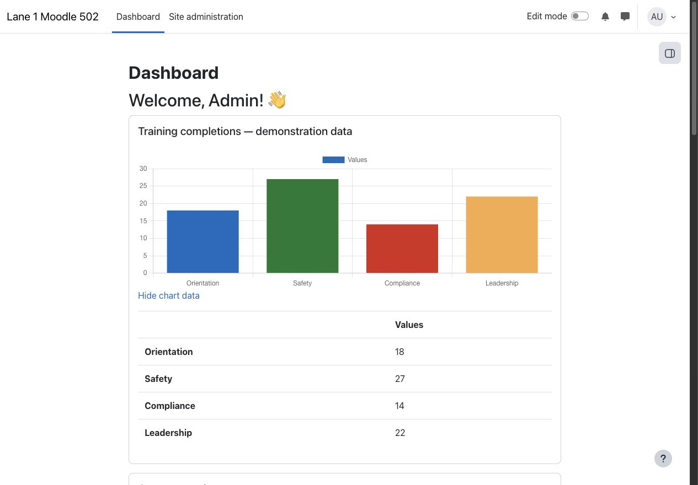
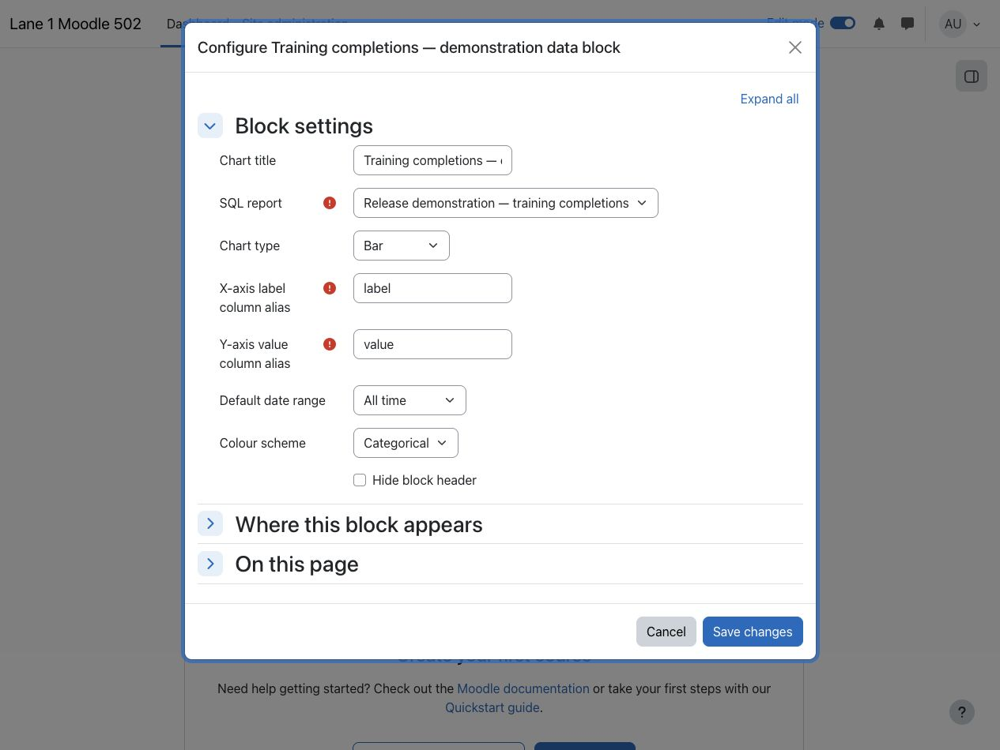
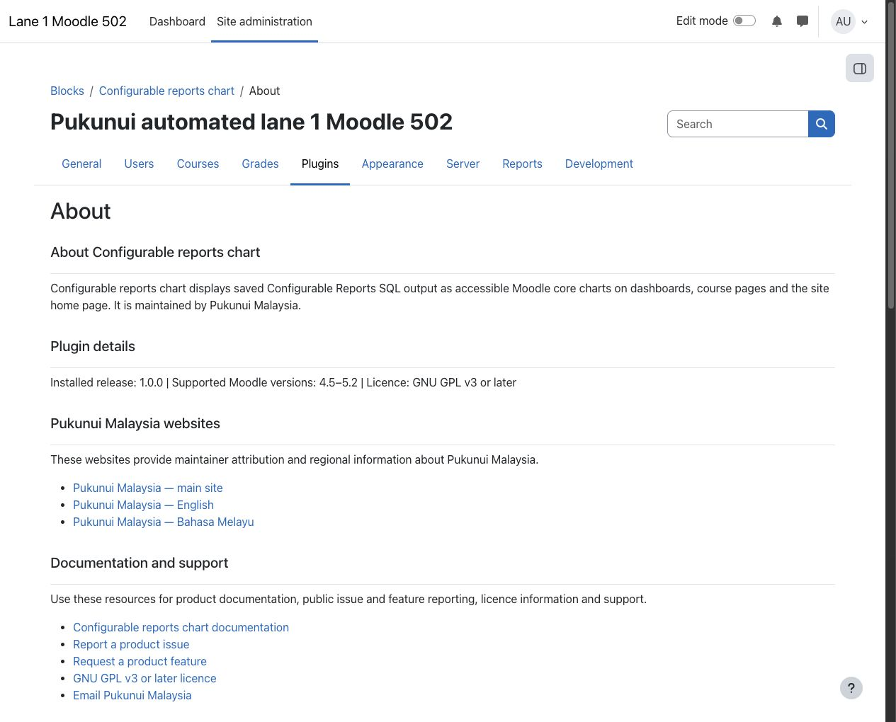

> **Pre-release product:** This product is ready for release and awaiting Marketplace publication. Its Marketplace listing may not yet be available.

# Configurable reports chart

Configurable reports chart turns saved SQL reports from Configurable Reports into accessible Moodle core charts. Authorised report viewers can place focused visual summaries on dashboards, course pages, and the site home page without duplicating the source report.

## Key features

- Display saved SQL results as bar, line, pie, or doughnut charts using Moodle's core Chart API.
- Add multiple independently configured chart blocks to a supported page.
- Choose the exact result columns used for chart labels and numeric values.
- Apply categorical, cool, or warm colour schemes, or keep Moodle's default colours.
- Supply all-time, 30-day, or 90-day values to supported Configurable Reports date placeholders.
- Preserve Configurable Reports visibility, course scope, and viewer permissions before reading cached or current results.
- Show an accessible data table alongside the chart through Moodle's standard chart output.
- Cache mapped chart data for up to 15 minutes while invalidating it when report SQL changes.

## Screenshots

### Dashboard chart

*The dashboard block presents a saved SQL report as a Moodle core chart with its accessible data table. All people, organisations, reports, and content shown are fictional demonstration data.*

### Block configuration

*Each block instance selects an available SQL report and maps its label and numeric value aliases to a chart. All people, organisations, reports, and content shown are fictional demonstration data.*

### Administrator About page

*The static About page derives release and Moodle compatibility values from the installed plugin metadata and provides maintained support links. All people, organisations, and content shown are fictional demonstration data.*

## Requirements

- Moodle 4.5 through Moodle 5.2.
- PHP and a database version supported by the selected Moodle release.
- [Configurable Reports](https://marketplace.moodle.com/plugins/block_configurable_reports) 4.1.0 or later installed and upgraded first.
- At least one visible SQL report whose viewer permissions allow the intended user to see it.
- No external service, service account, API credential, or additional build step is required.

One Configurable reports chart release package supports the full Moodle 4.5–5.2 range. Confirm compatibility before upgrading Moodle beyond that published range.

## Installation

Marketplace publication is pending. If Pukunui has provided the pre-release Configurable reports chart ZIP, open **Site administration > Plugins > Install plugins**, upload the ZIP, complete Moodle's validation, and follow the displayed upgrade steps.

Install or upgrade the required [Configurable Reports](https://marketplace.moodle.com/plugins/block_configurable_reports) dependency before installing this block. No post-install build, external service configuration, or manual database step is required.

## Configuration and use

### Prepare the source report

Create a SQL report in Configurable Reports, make it visible, and configure its course or global scope and viewer permissions. Give the label and numeric result columns clear aliases, for example `course_name` and `total_enrolled`.

The block accepts one read-only `SELECT` statement, including a `SELECT`-based common table expression. Results are limited to 5,000 rows. Report authors remain responsible for portable SQL and for ensuring the report exposes only data its intended viewers may access.

### Add and configure a chart

Turn editing on, add **Configurable reports chart** to a dashboard, course page, or the site home page, and configure these fields:

- **Chart title:** the optional heading for this block instance.
- **SQL report:** a visible SQL report available in the current page scope and permitted for the current viewer.
- **Chart type:** Bar, Line, Pie, or Doughnut.
- **X-axis label column alias:** the exact SQL result alias used for labels.
- **Y-axis value column alias:** the exact SQL result alias containing numeric values.
- **Default date range:** All time, Last 30 days, or Last 90 days for supported date placeholders in the report SQL.
- **Colour scheme:** Moodle's default colours or a supplied categorical, cool, or warm palette.
- **Hide block header:** remove the standard block heading when the surrounding page already provides enough context.

The selected date range supplies values to supported Configurable Reports time placeholders. It does not add an independent filter when the SQL report does not use those placeholders.

### View and update charts

Viewers see the chart only while the source report remains visible, in scope, and permitted for them. Mapped labels and values are cached for up to 15 minutes per report, user, course, and chart configuration. Editing the report SQL changes the cache identity so the revised query is used without waiting for the previous entry to expire.

Open **Site administration > Plugins > Blocks > Configurable reports chart > About** for the installed release, supported Moodle range, licence, maintainer websites, documentation, and public support links. The About page is informational and creates no configuration records.

## Privacy and permissions

Configurable reports chart creates no database tables, permanently stores no personal data, and sends no data to an external service. Its Privacy API provider declares that the block has no personal data of its own to export or delete.

For performance, Moodle's cache can temporarily hold the selected report's mapped labels and numeric values. Cache entries are scoped by report, user, course, chart configuration, date range, and current SQL. A source report can query personal data, so its author is responsible for the query, viewer permissions, and resulting output.

Moodle capabilities control who can add block instances to course pages or personal dashboards. Configurable Reports permissions independently control who can select and view each source report. Removing report access prevents the block from reading either cached or current chart data for that viewer. The administrator About page requires Moodle's site-configuration capability.

## Troubleshooting

- If no report is available in the selector, confirm that Configurable Reports is installed, the report type is SQL, the report is visible, its course or global scope matches the page, and the current user has report access.
- If the block requests configuration, select a report and enter both exact result-column aliases.
- If a configured column is not found, compare the alias with the column name returned by the SQL report, including spelling and underscores.
- If a value-column error appears, ensure every value returned by that alias is numeric.
- If the report returns no chartable data, run the source report directly and check its filters and date placeholders.
- If the block refuses the query, reduce it to one read-only `SELECT` statement and remove write operations or additional statements.
- If the chart does not immediately reflect unchanged report data, wait for the cache entry to expire or ask an administrator to purge Moodle caches.
- Before upgrading beyond Moodle 5.2, confirm that a newer plugin release explicitly supports the target Moodle version.

## Support and licence

- [Report a Configurable reports chart product issue](https://github.com/PukunuiMalaysia/moodle-docs/issues/new?template=product-bug.yml)
- [Request a Configurable reports chart feature](https://github.com/PukunuiMalaysia/moodle-docs/issues/new?template=feature.yml)
- [Report a documentation issue](https://github.com/PukunuiMalaysia/moodle-docs/issues/new?template=documentation.yml)
- [Pukunui Malaysia support](https://pukunui.com/location/malaysia/)
- [Email Pukunui Malaysia](mailto:hello.my@pukunui.com)

Configurable reports chart is licensed under the [GNU General Public License v3 or later](https://www.gnu.org/licenses/gpl-3.0.html). This documentation is licensed under [CC BY 4.0](https://creativecommons.org/licenses/by/4.0/).
