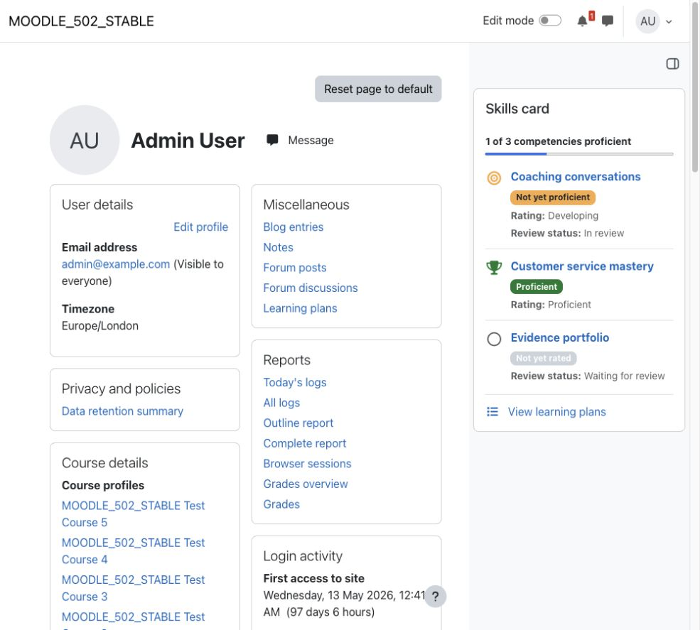

# Skills card

Skills card helps Moodle learners and authorised profile viewers understand competency progress through a compact block of proficiency, rating, review, framework, and learning-plan information.

## Key features

- Present all available Moodle user competency records in one compact block.
- Distinguish proficient, rated-but-not-proficient, and unrated states with visible text.
- Show resolved scale ratings, review states, and an overall progress total.
- Link to Moodle competency details and learning plans when the viewer is permitted.
- Display a clear **No competencies** state when no records are available.
- Support multiple block instances and responsive Boost layouts.

## Screenshots

### Competency overview

*The compact card makes competency status and progress visible without replacing Moodle's competency tools. All people, competencies, and results shown are fictional demonstration data.*

## Requirements

- Moodle 4.0 or later.
- Moodle competencies, frameworks, scales, and user competency records must be configured for meaningful output.
- No external service or additional Moodle plugin is required.

## Installation

Download the Skills card ZIP from its verified [Moodle Marketplace listing](https://marketplace.moodle.com/plugins/block_skillscard). In Moodle, open **Site administration > Plugins > Install plugins**, upload the ZIP, complete validation, and follow the displayed upgrade steps.

## Configuration and use

Turn editing on in a supported block region such as Dashboard, site home, a course, or an authorised user profile, then add **Skills card**. The block uses the current page context and Moodle's existing competency permissions; it does not require a separate settings page.

Users normally see their own competency records. An authorised viewer opening a supported user profile can see that person's permitted data and links. Generic page identifiers never select another user.

## Privacy and permissions

Skills card reads competency information already stored by Moodle and does not create its own personal-data store. Its Moodle Privacy API declaration therefore uses the null provider.

Moodle profile and competency capabilities control whether another user's data and detail links are visible. If the profile is not readable, the block is hidden rather than exposing competency information.

## Troubleshooting

- If **No competencies** appears, confirm that the user has competency records and that the framework and scale data remain available.
- If detail or learning-plan links are absent, check the viewer's Moodle competency capabilities.
- If a profile block is hidden, confirm that the viewer can access that user's profile and competency information.
- If new records are not visible, refresh the page after Moodle has updated competency data.

## Support and licence

- [Report a Skills card product issue](https://github.com/PukunuiMalaysia/moodle-docs/issues/new?template=product-bug.yml)
- [Request a Skills card feature](https://github.com/PukunuiMalaysia/moodle-docs/issues/new?template=feature.yml)
- [Report a documentation issue](https://github.com/PukunuiMalaysia/moodle-docs/issues/new?template=documentation.yml)
- [Pukunui Plugin Subscription Terms & Support Policy](https://pukunui.com/docs/policy-moodle-marketplace/)
- [Pukunui Malaysia](https://pukunui.com/location/malaysia/)

Skills card is licensed under the GNU General Public License v3 or later. This documentation is licensed under [CC BY 4.0](https://creativecommons.org/licenses/by/4.0/).

---

Source: [moodle-block_skillscard at `9a93e3a29262`](https://github.com/PukunuiMalaysia/moodle-block_skillscard/commit/9a93e3a292623aa37a3ca1ecf5a02b17f471c306). [Report a documentation issue](https://github.com/PukunuiMalaysia/moodle-docs/issues/new?template=documentation.yml).
