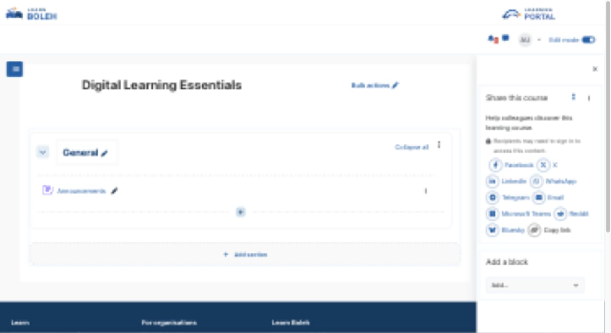
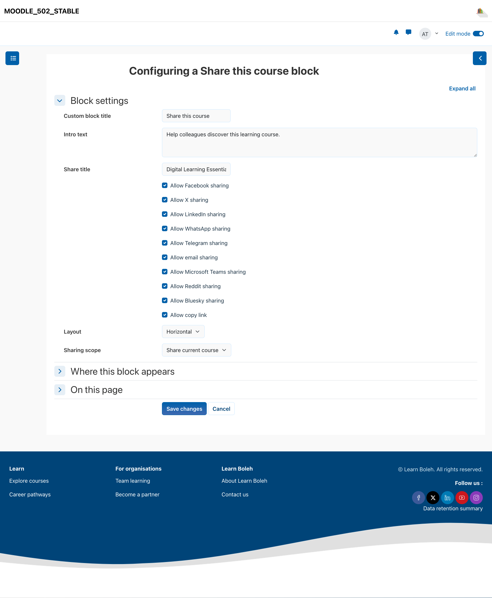

# SocialLink

SocialLink helps Moodle learners and course teams share suitable site, course, and activity pages through configurable social, messaging, email, and copy-link actions without loading third-party widgets on the page.

## Key features

- Offer Facebook, X, LinkedIn, WhatsApp, Telegram, email, Microsoft Teams, Reddit, Bluesky, and copy-link actions.
- Use the current Font Awesome icons supplied by Moodle core.
- Choose site, course, activity, or current-page scope where the page is safe to share.
- Display providers horizontally or vertically with optional title and introductory text.
- Configure administrator defaults while allowing permitted block-instance choices.
- Exclude dashboards, profiles, administration, grading, submissions, attempts, reviews, editing workflows, and user-specific action pages.

## Screenshots

### Learner view

*The learner-facing block presents the sharing providers selected for the page. All people, courses, and content shown are fictional demonstration data.*

### Teacher configuration

*Permitted course editors can configure the block instance while site defaults remain centrally managed. All people, courses, and content shown are fictional demonstration data.*

## Requirements

- Moodle 4.5 through 5.2.
- A Moodle theme that provides the standard core Font Awesome icon set, including Boost.
- No provider API credentials, third-party widget, remote icon service, or additional Moodle plugin is required.

## Installation

Download the SocialLink ZIP from its verified [Moodle Marketplace listing](https://marketplace.moodle.com/plugins/block_sociallink). In Moodle, open **Site administration > Plugins > Install plugins**, upload the ZIP, complete validation, and follow the displayed upgrade steps.

## Configuration and use

### Administrator defaults

Open **Site administration > Plugins > Blocks > SocialLink** to choose the default providers and presentation for new instances.

### Add SocialLink to a page

Turn editing on, add **SocialLink**, select the providers and horizontal or vertical layout, add optional title or introductory text, and choose a permitted sharing scope. Save the block and review it with editing off.

The block resolves only pages suitable for sharing. A reading page may be shared, while protected, personal, administrative, grading, or state-changing pages remain unavailable.

## Privacy and permissions

SocialLink stores site and block-instance configuration but no personal data. It does not contact social networks when a Moodle page loads. When a user chooses a provider, the browser opens that service and the service may process the shared URL and signed-in account information under its own terms.

Moodle capabilities control who can add and configure a block. Page policy and URL validation prevent unsafe or user-specific Moodle pages from being offered as sharing targets.

## Troubleshooting

- If an expected provider is missing, check both the site defaults and the block-instance provider selection.
- If a sharing action is unavailable, confirm that the current page is a reading page rather than a private, administrative, grading, submission, review, or editing workflow.
- If icons do not display, purge Moodle caches and confirm the active theme supplies Moodle's standard icon set.
- If a destination rejects the URL, test the page without authentication-specific or private query values.

## Support and licence

- [Report a SocialLink product issue](https://github.com/PukunuiMalaysia/moodle-docs/issues/new?template=product-bug.yml)
- [Request a SocialLink feature](https://github.com/PukunuiMalaysia/moodle-docs/issues/new?template=feature.yml)
- [Report a documentation issue](https://github.com/PukunuiMalaysia/moodle-docs/issues/new?template=documentation.yml)
- [Pukunui Plugin Subscription Terms & Support Policy](https://pukunui.com/docs/policy-moodle-marketplace/)
- [Pukunui Malaysia](https://pukunui.com/location/malaysia/)

SocialLink is licensed under the GNU General Public License v3 or later. This documentation is licensed under [CC BY 4.0](https://creativecommons.org/licenses/by/4.0/).

---

Source revision: `578996760e8a`. [Report a documentation issue](https://github.com/PukunuiMalaysia/moodle-docs/issues/new?template=documentation.yml).
