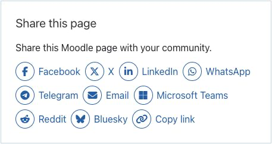

# SocialLink

SocialLink adds configurable sharing links to Moodle pages, courses, activities, and the site front page. Available destinations include Facebook, X, LinkedIn, WhatsApp, Telegram, email, Microsoft Teams, Reddit, Bluesky, and the browser clipboard. Each destination uses its current Font Awesome icon supplied by Moodle core.

## Requirements and installation

- Moodle 4.5 through 5.2.
- Install at `blocks/sociallink`, complete the Moodle upgrade, and configure default providers under **Site administration > Plugins > Blocks > SocialLink**.
- Add the block where sharing links should appear, then choose page scope, layout, providers, optional title, and introductory text.

No provider API credential, third-party JavaScript widget, bundled icon font, or external icon request is required.

## Screenshots

### Learner view

The block can display all supported providers in a compact horizontal layout.

### Teacher configuration

Teachers with block-management permission can choose the title, introductory text, providers, layout, and sharing scope for the course.

## Configuration

1. Turn editing on in a course or other supported Moodle page.
2. Add the **SocialLink** block.
3. Configure the visible providers and choose a horizontal or vertical layout.
4. Choose whether links share the current page, site, course, or activity where permitted.
5. Save the block and turn editing off to review the learner-facing result.

## Privacy and external services

The block stores only site and block-instance configuration. It does not store personal data and does not contact social networks on page load. When a user follows a share link, they leave Moodle and the selected service may process the shared URL and browser or signed-in account information under that service's terms.

## Support

- [Report a bug or request a feature](https://github.com/PukunuiMalaysia/moodle-docs/issues/new?template=product-bug.yml)
- [Pukunui Plugin Subscription Terms & Support Policy](https://pukunui.com/docs/policy-moodle-marketplace/)
- [Pukunui Malaysia](https://pukunui.com/home/location/malaysia/)

Original documentation copyright Pukunui Sdn Bhd and contributors, licensed under [CC BY 4.0](https://creativecommons.org/licenses/by/4.0/).

---

Source revision: `f411bc4b6739`. [Report a documentation issue](https://github.com/PukunuiMalaysia/moodle-docs/issues/new?template=documentation.yml).
