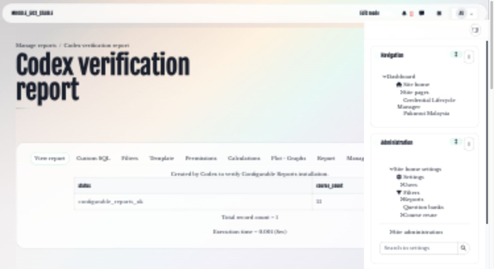

# Configurable Reports SQL query library

The Configurable Reports SQL query library helps Moodle administrators build practical course, activity, grade, user, storage, backup, file-reuse, and operational reports from a reviewed collection of reusable queries.

## Key features

- Organise queries by administration, course, user, assignment, gradebook, H5P, quiz, and deduplication use cases.
- Preserve Configurable Reports placeholders for site, course, and filter context.
- Provide readable SQL with explicit joins and stable result ordering.
- Support clickable Moodle destinations where a report requires them.
- Include operational queries for storage, files, backups, and content reuse.
- Allow administrators to review and adapt each query for the site's Moodle version and database engine.

## Screenshots

### Representative report

*A representative query rendered through Configurable Reports with filtering, export, and management controls. All people, courses, records, and results shown are fictional demonstration data.*

## Requirements

- A maintained Moodle site with database access through Moodle's reporting layer.
- The Configurable Reports block and permission to create SQL reports.
- A staging site is strongly recommended for expensive storage, file, backup, deduplication, and cross-activity queries.
- Individual queries may require adaptation for the site's Moodle version or MySQL/PostgreSQL differences.

## Installation

Install a compatible release of [Configurable Reports](https://marketplace.moodle.com/plugins/block_configurable_reports) from Moodle Marketplace using Moodle's normal plugin installer. The SQL library itself is not installed as a Moodle plugin: select the supplied `.sql` query for the required reporting area and paste it into a new Configurable Reports SQL report.

## Configuration and use

### Add a query

Create an SQL report in Configurable Reports, copy the selected query into the SQL field, preserve `prefix_` table names, and keep placeholders such as `%%WWWROOT%%`, `%%COURSEID%%`, and `%%FILTER_*%%` unchanged unless the report instructions require a deliberate adjustment.

### Validate before production

Review the query purpose, selected columns, joins, filters, and expected row count. Run it with representative fictional data in staging first. For a potentially expensive report, require narrow filters and inspect database load before making it available to other users.

## Privacy and permissions

Queries can expose identity, grades, activity, files, backups, and other personal or operational information. Grant the minimum Configurable Reports capability, avoid public report pages, limit output columns, and protect exported results under the site's Moodle privacy and retention policies.

Never include credentials, private hostnames, customer data, or production exports in a support request. Administrators remain responsible for checking each query against local roles, database permissions, and data-governance requirements.

## Troubleshooting

- If Moodle reports a missing table, field, or function, compare the query with the site's Moodle version and database engine.
- If a placeholder appears literally, confirm that it retains the exact Configurable Reports `%%...%%` syntax.
- If a report is slow, add a suitable filter, reduce the date or course scope, and review the query plan in staging.
- If links are incorrect, confirm that the `%%WWWROOT%%` and course-context placeholders are present.

## Support and licence

- [Report a SQL query library product issue](https://github.com/PukunuiMalaysia/moodle-docs/issues/new?template=product-bug.yml)
- [Request a SQL query or enhancement](https://github.com/PukunuiMalaysia/moodle-docs/issues/new?template=feature.yml)
- [Report a documentation issue](https://github.com/PukunuiMalaysia/moodle-docs/issues/new?template=documentation.yml)
- [Pukunui Malaysia](https://pukunui.com/location/malaysia/)

The SQL query library is licensed under the GNU General Public License v3 or later unless a supplied file states otherwise. This documentation is licensed under [CC BY 4.0](https://creativecommons.org/licenses/by/4.0/).

---

Source: [moodle-configurable_reports-custom_sql_queries at `b349eefcf462`](https://github.com/PukunuiMalaysia/moodle-configurable_reports-custom_sql_queries/commit/b349eefcf462ec2e69d59ad7b3660e88caf29f24). [Report a documentation issue](https://github.com/PukunuiMalaysia/moodle-docs/issues/new?template=documentation.yml).
