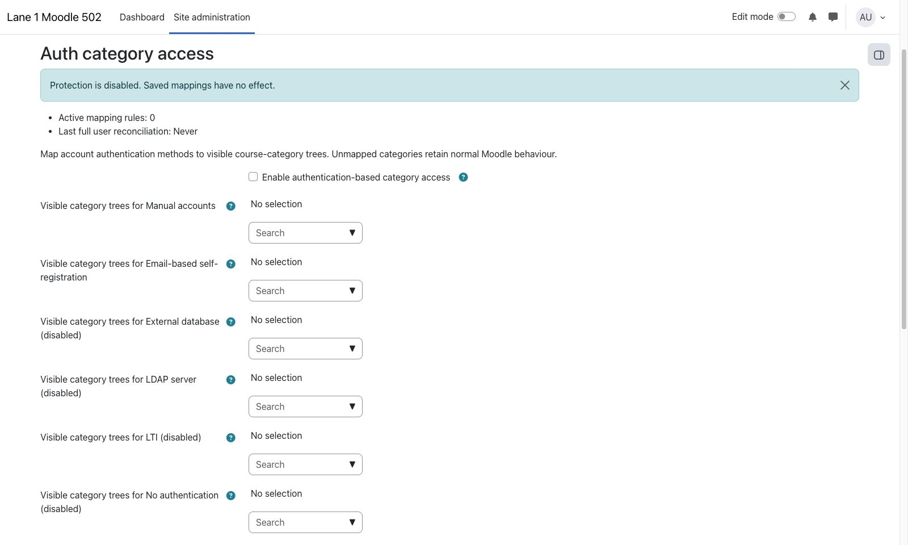

> **Pre-release product:** This product is ready for release and awaiting Marketplace publication. Its Marketplace listing may not yet be available.

# Auth category access

`local_authcategoryaccess` maps the authentication method stored on each Moodle account to one or more course-category trees. It uses Moodle's core `moodle/category:viewcourselist` capability so the wrong audience cannot discover protected categories, courses, or the non-enrolled course-information and enrolment page.

The plugin is intended for sites that separate audiences by authentication method, such as Microsoft 365 single sign-on for staff and manual or email self-registration for external participants.

## Key features

- Disabled-by-default master switch.
- Dynamic mappings for every installed authentication plugin except `nologin`; enabled methods are listed first and disabled methods are marked.
- Multiple roots per authentication method and shared roots across methods.
- Complete category-subtree inheritance.
- Validation that rejects ancestor and descendant roots in the same configuration.
- Plugin-owned system roles and assignments, repaired at account creation, account update, login, mapping changes, and nightly cron.
- Exact restoration of pre-existing Authenticated user and Guest permission overrides on disable or uninstall.
- Fail-closed handling when category moves make saved roots overlap.
- No external services, third-party libraries, credentials, or user-profile copies.

## Screenshots

*Administrators map authentication methods to category trees. All people and content shown are fictional demonstration data.*

## Requirements

- Moodle 4.5 LTS through Moodle 5.2.
- Moodle 4.5: PHP 8.1 or later supported by that Moodle branch.
- Moodle 5.0 and 5.1: PHP 8.2 or later supported by that Moodle branch.
- Moodle 5.2: PHP 8.3 or later supported by that Moodle branch.

## Installation

Marketplace publication is pending. No post-install build or manual database step is required.

1. Obtain the pre-release ZIP whose top-level directory is `authcategoryaccess`.
2. In Moodle, open **Site administration > Plugins > Install plugins**.
3. Upload the ZIP and complete the normal Moodle upgrade screen.
4. Open **Site administration > Plugins > Local plugins > Auth category access > Settings**.

## Configuration and use

Leave the master switch off while selecting category roots for each authentication method. A selected root covers its complete subtree. The same root may be assigned to multiple authentication methods, but no selected root may be an ancestor or descendant of another selected root.

Select **Enable authentication-based category access** when ready, then **Save and synchronise now** to apply the mapping and queue a batched reconciliation of existing users. New and changed accounts are synchronised immediately, as are users when they log in. A nightly scheduled task repairs role, capability, protection, and assignment drift.

Categories that are not beneath a mapped root retain normal Moodle behaviour. An unmapped or unknown authentication method receives no plugin grant for protected roots. Guests are denied protected roots. Site administrators retain their normal access.

If a category move, deletion race, or removed authentication plugin makes the saved configuration invalid, the plugin removes all of its audience grants but retains the protective `Prevent` overrides. The Settings page reports the fail-closed state until an administrator corrects and saves the mappings.

### Scope and access boundary

Version 1 controls category and course discovery plus the non-enrolled course-information and enrolment page. It does not create, remove, validate, or block enrolments.

An active Moodle enrolment can still expose its course through My courses, the Dashboard, course navigation, notifications, or a direct course URL.

Moodle's own hidden-category and hidden-course settings remain authoritative. This plugin never grants `moodle/category:viewhiddencategories` or `moodle/course:viewhiddencourses`.

## Privacy and permissions

All configuration changes require the core `moodle/site:config` capability and a valid Moodle form session key. The plugin uses core Roles, Capability, Context, Event, Task, Lock, DML, and XMLDB APIs.

The plugin's three tables contain configuration only: authentication plugin shortnames, category IDs, plugin-owned role IDs, timestamps, and permission-restoration snapshots. No user profile or credential is copied into plugin tables. Plugin-owned assignments are stored by Moodle's Roles subsystem in `role_assignments` with `component = local_authcategoryaccess`; the Privacy API declares that subsystem link.

On disable, the plugin removes its category grants and restores the captured Authenticated user and Guest overrides. On uninstall, it additionally removes plugin-owned assignments and deletes only roles recorded in its ownership table.

## Troubleshooting

- If a user sees no protected categories, confirm the account's `auth` value is mapped and run **Save and synchronise now**.
- If the page reports fail-closed protection, remove the ancestor/descendant overlap created by a category move and save again.
- If an authentication plugin is disabled, its mapping remains available and is clearly marked; accounts using it still match by the stored shortname.
- If an authentication plugin has been uninstalled while mapped, repair the configuration by removing that stale mapping.
- If a user is enrolled in a hidden-audience course, the enrolment boundary above applies.

## Support and licence

- [Report an Auth category access product issue](https://github.com/PukunuiMalaysia/moodle-docs/issues/new?template=product-bug.yml)
- [Request an Auth category access feature](https://github.com/PukunuiMalaysia/moodle-docs/issues/new?template=feature.yml)
- [Report a documentation issue](https://github.com/PukunuiMalaysia/moodle-docs/issues/new?template=documentation.yml)
- [Pukunui Malaysia support](https://pukunui.com/location/malaysia/)
- [Contact Pukunui Malaysia](mailto:hello.my@pukunui.com)

Auth category access is licensed under the GNU General Public License v3 or later. This documentation is licensed under [CC BY 4.0](https://creativecommons.org/licenses/by/4.0/).
