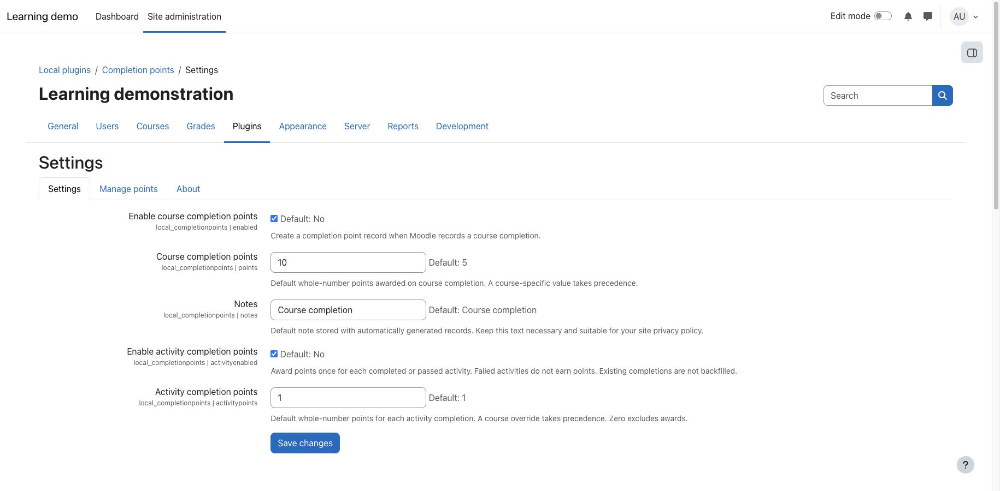
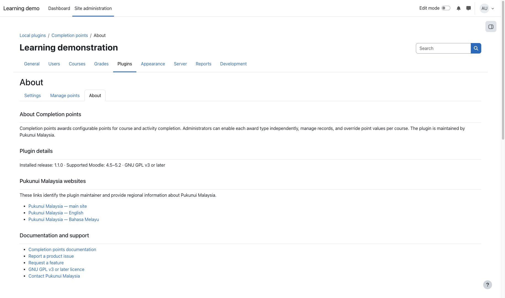
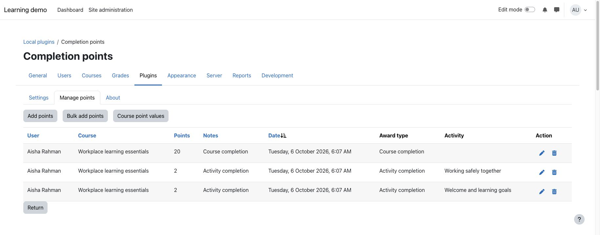
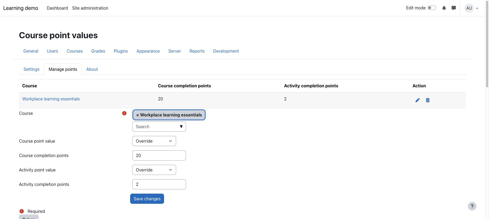

> **Pre-release product:** This product is ready for release and awaiting Marketplace publication. Its Marketplace listing may not yet be available.

# Completion points

Completion points awards configurable points for course and activity completion. Site administrators can enable each award type independently, set site defaults, override either value per course, and manage or import records.

## Key features

- Award course and activity points independently, or enable both for additive awards.
- Set whole-number site defaults and a privacy-conscious course-award note.
- Independently inherit or override either award value per course; zero excludes an award.
- Prevent repeated awards when completion is toggled or a displayed record is deleted.
- Navigate directly between Settings, Manage points, and About tabs.
- Let authorised administrators view, add, edit, delete, and import records from one protected management area.
- Import up to 1,000 records per CSV file with validation and clear skipped-row feedback.
- Use Moodle's Privacy API to declare, export, and delete the user-linked data stored by the plugin.
- Operate entirely within Moodle without an external service, API credential, build tool, or paid dependency.

## Screenshots

### Settings



*The Settings tab contains independent course and activity switches and site-wide defaults. All people, courses, organisations, and content shown are fictional demonstration data.*

### About



*The About page derives the installed release and supported Moodle range from plugin metadata. All people, courses, organisations, and content shown are fictional demonstration data.*

### Record management



*Authorised administrators can manage manual records, CSV imports, and course-specific values from this page. All people, courses, organisations, and content shown are fictional demonstration data.*

### Course-specific values



*Either award type can inherit the site default or use a course-specific value. All content shown is fictional demonstration data.*

## Requirements

- Moodle 4.5 LTS through Moodle 5.2.
- Moodle completion tracking must be enabled for the applicable course or activity.
- Any database supported by the applicable Moodle release.
- No third-party library or external service is required.

The optional Completion points view block can display records created by this plugin. The local plugin does not require that block and can be installed and used independently.

## Installation

Marketplace publication is pending. If Pukunui has provided the pre-release plugin ZIP, open **Site administration > Plugins > Install plugins**, upload the ZIP, complete Moodle's validation and upgrade steps, and then open **Site administration > Plugins > Local plugins > Completion points > Settings**. No post-install build or command-line step is required.

## Configuration and use

### Configure automatic awards

Open **Site administration > Plugins > Local plugins > Completion points > Settings**. Use **Enable course completion points** and **Enable activity completion points** independently. Configure the **Course completion points**, course **Notes**, and **Activity completion points** defaults. Activity awards are disabled initially and default to one point when enabled.

An activity earns points when Moodle marks it complete or complete/pass; incomplete or failed states do not earn points. A learner can earn activity awards and a separate course award. Each automatic award is processed once per learner/course or learner/activity. Completion resets and deleted award records do not allow repeat awards. Disabling either switch stops future awards of that type without deleting history.

Settings changes affect future completion events only: existing completions are not backfilled and earned points are not recalculated. Historical records retain their values and are labelled **Legacy record**, because the earlier schema did not record their origin. Duplicate protection applies to automatic completions processed by version 1.1.0 onwards; prior awards cannot be matched reliably to completion events.

### Manage records and course values

Open the **Manage points** tab directly. Authorised administrators can add, edit, delete, or import records. Award-type and activity labels distinguish automatic awards from manual, imported, and legacy records. Automatic award recipients and courses are fixed; their points and notes can be corrected.

Use **Course point values** to choose **Use site default** or **Override** separately for course and activity awards. An activity override applies to every qualifying activity in that course; individual-activity overrides are not available. Zero excludes that award type and still records the completion as processed.

### Import records from CSV

Use **Bulk add points** on the management page. Keep this exact header as the first row:

```csv
username,course_shortname,points,notes
```

Use exact Moodle usernames and course short names, whole numbers for points, and notes no longer than 255 characters. Each file can contain up to 1,000 data rows. The result reports imported and skipped rows so errors can be corrected without exposing the data to unauthorised users.

## Privacy and permissions

The plugin stores the Moodle user ID, course ID, activity ID where applicable, award source, points, note, and timestamps. Separate completion receipts retain user, course, source, completed item, and creation time to prevent repeated automatic awards, including zero-point completions and deleted displayed records. Privacy discovery, export, and deletion cover both records and receipts; privacy erasure also removes duplicate protection for the erased user. Notes can contain personal information, so administrators should keep them necessary and apply the site's retention policy. The plugin does not send data to an external service.

The `local/completionpoints:manage` capability protects every record-management, course-value, and import page. It is granted to the manager archetype by default and can be assigned through Moodle's standard role controls. The Privacy API provider supports metadata declaration, user discovery, export, per-user deletion, bulk user deletion, and deletion for the system context.

## Troubleshooting

- If points are not created, check the relevant award switch, completion tracking, and course override. Zero excludes an award; repeated events, failed activities, and completions predating activation are not backfilled.
- If the wrong value is awarded, check for a course-specific value before changing the site default.
- If a user cannot open the management page, confirm that their role has `local/completionpoints:manage` in the system context.
- If a CSV row is skipped, verify the exact header, username, course short name, whole-number points value, and 255-character note limit.
- If the plugin does not appear after installation, complete Moodle's upgrade process, confirm that the package contains one `completionpoints` directory, and purge caches.
- Before upgrading beyond Moodle 5.2, confirm that a newer plugin release explicitly supports the target Moodle version.

## Support and licence

- [Report a Completion points product issue](https://github.com/PukunuiMalaysia/moodle-docs/issues/new?template=product-bug.yml)
- [Request a Completion points feature](https://github.com/PukunuiMalaysia/moodle-docs/issues/new?template=feature.yml)
- [Report a documentation issue](https://github.com/PukunuiMalaysia/moodle-docs/issues/new?template=documentation.yml)
- [Pukunui Malaysia support](https://pukunui.com/location/malaysia/)
- [Contact Pukunui Malaysia](mailto:hello.my@pukunui.com)

Completion points is licensed under the GNU General Public License v3 or later. This documentation is licensed under [CC BY 4.0](https://creativecommons.org/licenses/by/4.0/).
