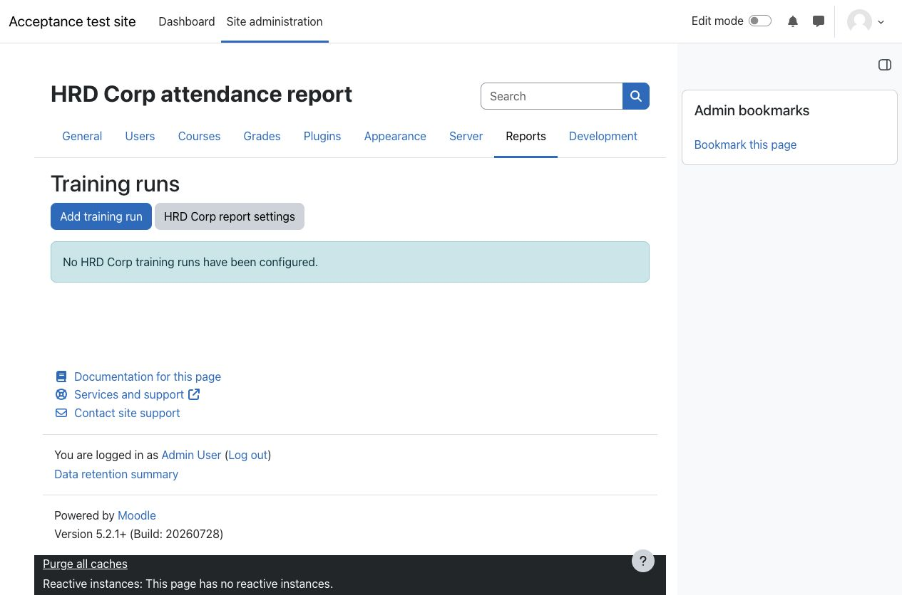
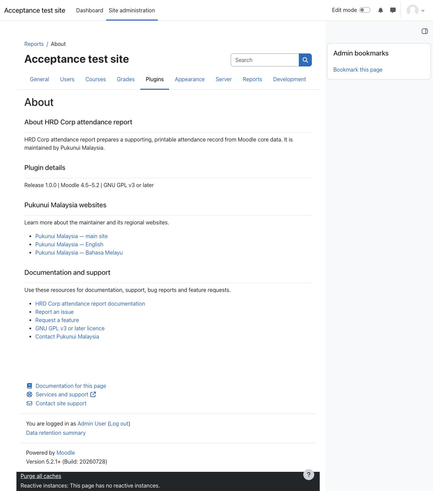

> **Pre-release product:** This product is ready for release and awaiting Marketplace publication. Its Marketplace listing may not yet be available.

# HRD Corp attendance report

HRD Corp attendance report helps Moodle site administrators prepare a supporting, printable attendance record for self-paced e-learning and live remote training. Each training run combines one Moodle course, one group and one employer with scheduled windows, a current participant roster, Moodle activity evidence and explicit daily attendance decisions.

The report supports provider and employer verification; it does not decide claim eligibility, apply an attendance threshold, create an official HRD Corp form or upload a claim to eTRiS.

## Key features

- Save training runs with the course, group, employer, delivery mode, scheduled windows, participant roles, references and optional signatory prefill.
- Resolve current participants from group membership and course-role assignments without creating a separate roster snapshot.
- Read employer, NRIC, citizenship and gender from configured Moodle core or custom user profile fields.
- Show first and last qualifying Standard logstore activity and the observed activity span inside each scheduled window, excluding breaks between windows.
- Record each participant-day manually as **Pending**, **Present** or **Absent** without inferring attendance from activity counts or duration.
- Require an administrator-supplied reason when **Present** is recorded without Moodle activity evidence.
- Block final printing until required provider, run, participant and attendance information is ready.
- Produce an A4 landscape browser print view with evidence warnings and blank provider and employer certification areas.

## Screenshots

### Training runs

*The site-administration report lists saved training runs and provides the controlled starting point for creating a run.*

### About page

*The static About page derives the installed release and supported Moodle range from plugin metadata and provides maintainer, documentation, support and licence links.*

All people and content shown are fictional demonstration data from a clean Moodle acceptance-test site.

## Requirements

- Moodle 4.5, 5.0, 5.1 or 5.2.
- Site-administrator access.
- Moodle Standard logstore enabled for activity evidence.
- Participant employer, NRIC, citizenship and gender values available in Moodle core fields or custom user profile fields.
- PHP and a database supported by the selected Moodle version. The plugin is designed for MySQL and PostgreSQL.

No additional plugin, third-party library or external service is required.

## Installation

Moodle Marketplace publication is pending. If Pukunui has provided the pre-release HRD Corp attendance report ZIP, open **Site administration > Plugins > Install plugins**, upload the ZIP and complete Moodle's validation and upgrade steps.

After installation, configure the report under **Site administration > Plugins > Reports > HRD Corp attendance report**, then open **Site administration > Reports > HRD Corp attendance report**.

## Configuration and use

### Configure the provider and participant fields

Enter the training provider's registered legal name and MyCoID. Optional provider signatory details are prefill only; signatures, the company stamp and certification date remain blank. Map employer name, NRIC, citizenship and gender to appropriate Moodle core or custom profile fields.

### Create a training run

Choose one course, one group and one employer, select the course roles that identify participants, and add one or more non-overlapping scheduled windows. Separate morning and afternoon windows keep the break out of observed-duration calculations. Participants are current group members who currently hold at least one selected role in the course.

### Record attendance and review evidence

For each training date, review the first and last qualifying Moodle events and the observed activity span inside the scheduled windows. Record every participant manually as **Present** or **Absent**. **Pending** remains an unresolved state. When **Present** has no Moodle evidence, provide a reason explaining the evidence gap.

### Generate the final report

Preview can show readiness errors. Resolve incomplete configuration, missing participant identity data, employer mismatches, missing participants, pending decisions and unexplained evidence gaps before generating the final view. Print or save the final view as PDF from the browser, then obtain the required provider and employer certifications outside Moodle.

Group membership, role assignments, profile values and Standard logstore data are read when the report is regenerated. Changes to those sources can therefore change the result. Removing and re-adding a participant makes an older attendance decision stale and pending.

## Privacy and permissions

Release 1.0 is deliberately restricted to site administrators. Every route requires site configuration authority and the relevant view, manage, record-attendance or print capability in the system context.

The plugin stores training-run configuration, optional signatory names and designations, attendance decisions, evidence-gap reasons, decision-maker IDs and run-modifier IDs. It reads participant identity values from Moodle core or custom profile fields and qualifying event times from Standard logstore without copying those values into the report tables.

Moodle's Privacy API supports metadata, context discovery, user listing, export and deletion. Participant deletion removes that participant's attendance rows. Decision-maker deletion anonymises actor references and clears their reason text, which can make the final report require a new reason. The plugin sends no data to an external service.

## Troubleshooting

- **Final printing is blocked:** read each readiness message and complete the missing provider, run, participant or attendance information.
- **A participant is missing:** confirm current membership of the selected group and a current assignment to one of the selected course roles.
- **Employer mismatch is reported:** compare the mapped participant employer value with the run employer; surrounding whitespace and letter case are ignored, but the normalised values must match.
- **No Moodle evidence appears:** confirm that Standard logstore is enabled, retained for the reporting period and contains non-anonymous events for the participant, course and scheduled window.
- **Observed duration looks shorter than the schedule:** it is the sum of first-to-last event spans within each scheduled window, not planned time, authenticated session time or proof of continuous activity.
- **A previous decision becomes pending:** the participant may have been removed and re-added to the group after the decision was recorded.
- **Print layout varies:** use a current browser with the Boost theme, select A4 landscape, and inspect long names, warnings, page breaks and both certification blocks before use.

This report is supporting evidence only. Training providers and employers remain responsible for source accuracy, certifications and the current claim rules. The functional interpretation was last reviewed on 7 September 2026 against HRD Corp's [claim supporting-document guidance](https://supportcentre.hrdcorp.gov.my/portal/en/kb/articles/claim), [generated-attendance-report guidance](https://supportcentre.hrdcorp.gov.my/portal/en/kb/articles/guidelines-for-generated-attendance-report) and [training-provider claim guide](https://supportcentre.hrdcorp.gov.my/portal/en/kb/articles/hrd-corp-claimable-course-claim-tp).

## Support and licence

- [Report an HRD Corp attendance report product issue](https://github.com/PukunuiMalaysia/moodle-docs/issues/new?template=product-bug.yml)
- [Request an HRD Corp attendance report feature](https://github.com/PukunuiMalaysia/moodle-docs/issues/new?template=feature.yml)
- [Report a documentation issue](https://github.com/PukunuiMalaysia/moodle-docs/issues/new?template=documentation.yml)
- [Pukunui Malaysia support](https://pukunui.com/location/malaysia/)
- [Email Pukunui Malaysia support](mailto:hello.my@pukunui.com)

HRD Corp attendance report is licensed under the [GNU General Public License v3 or later](https://www.gnu.org/licenses/gpl-3.0.html). This documentation is licensed under [CC BY 4.0](https://creativecommons.org/licenses/by/4.0/).
