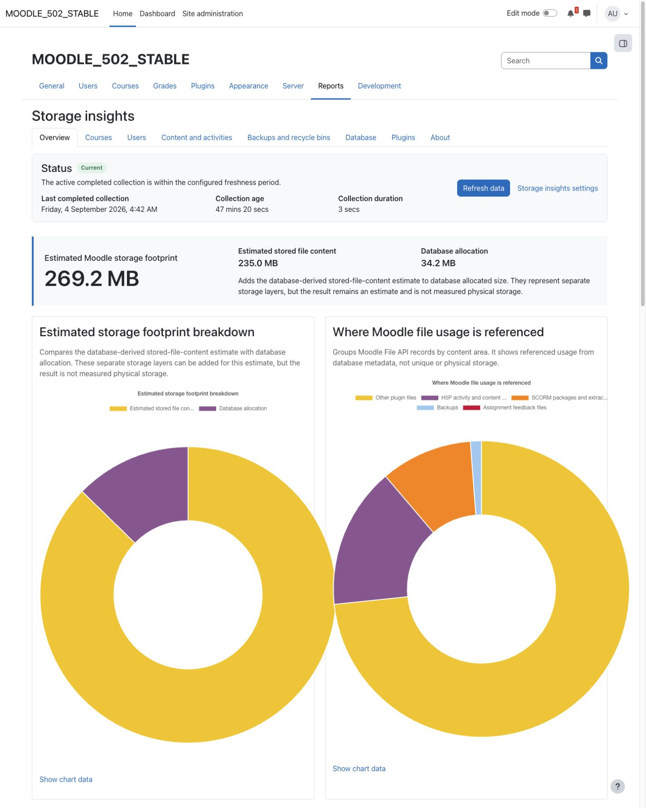
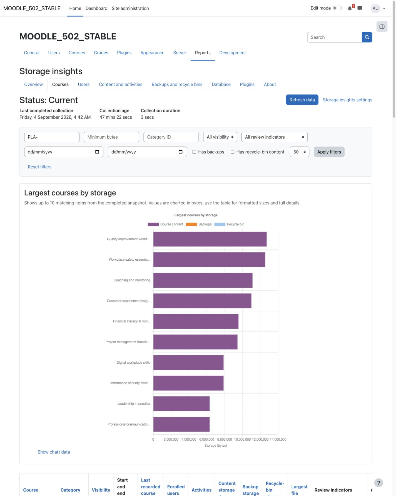
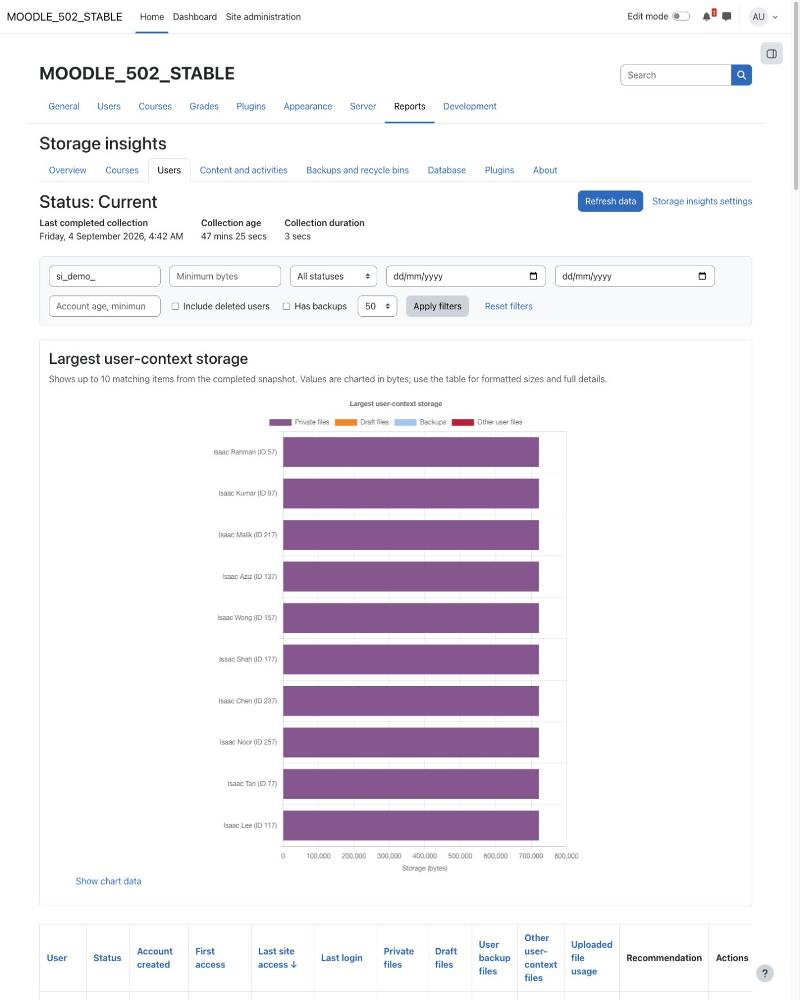
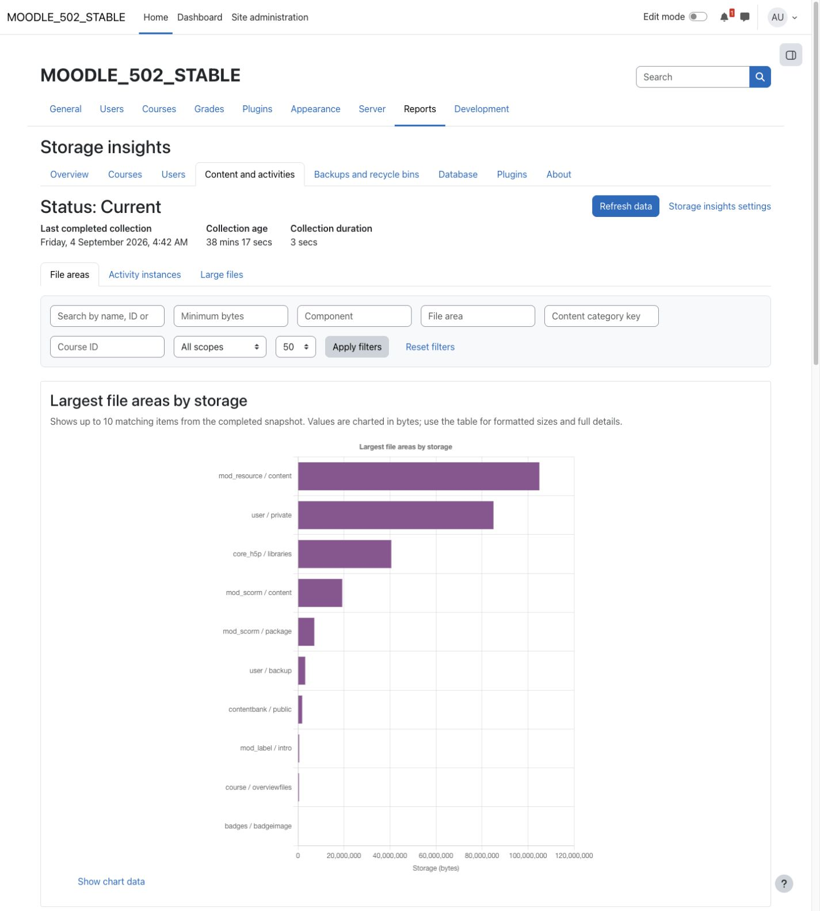
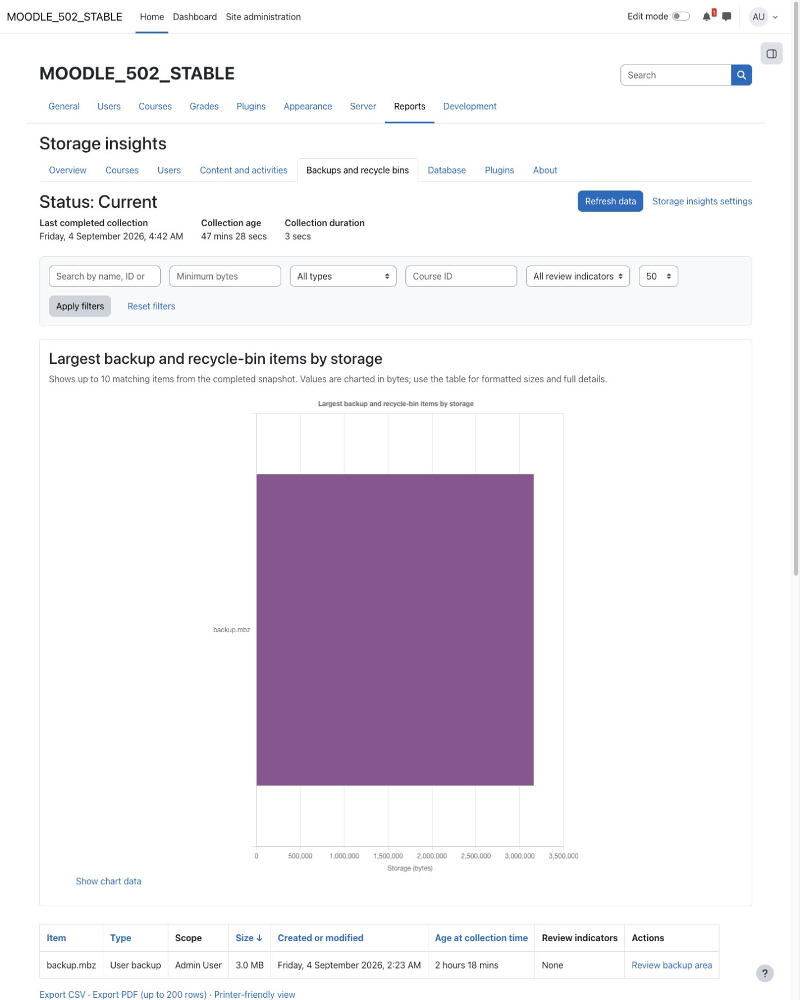
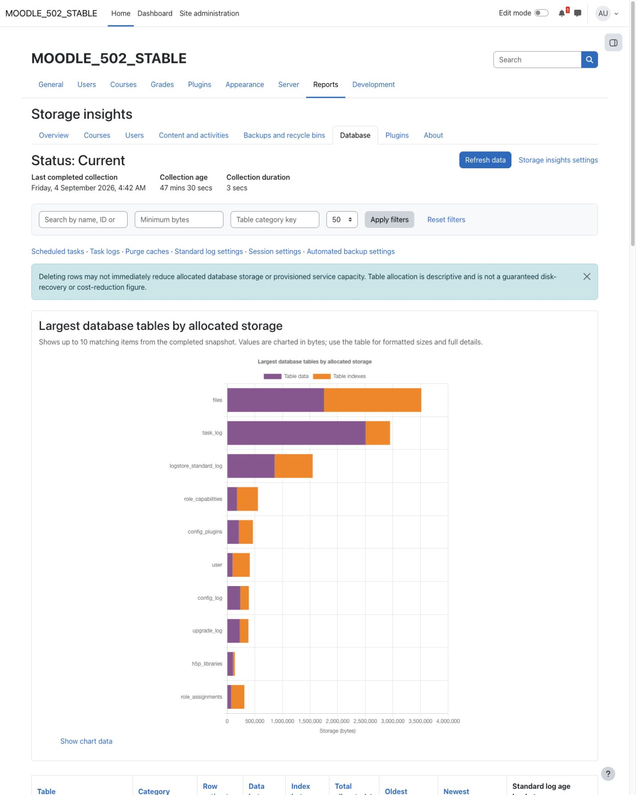
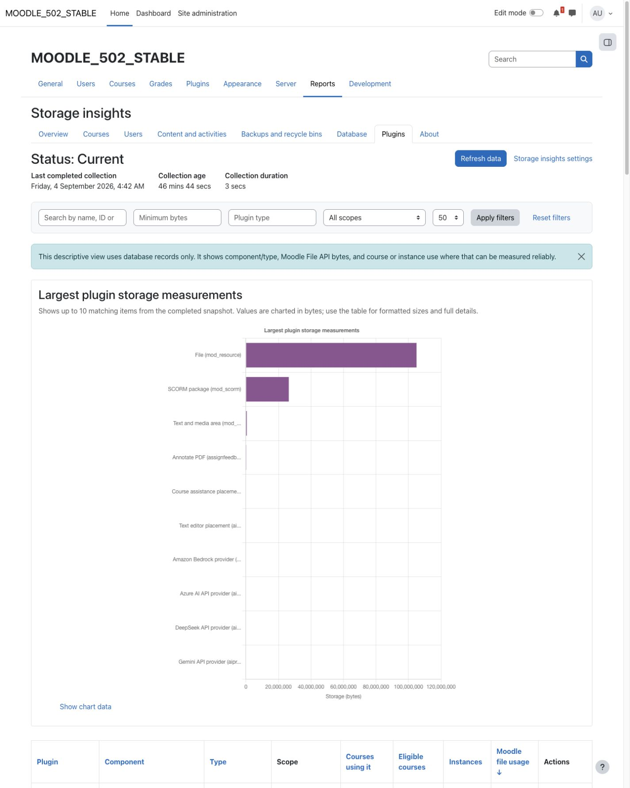
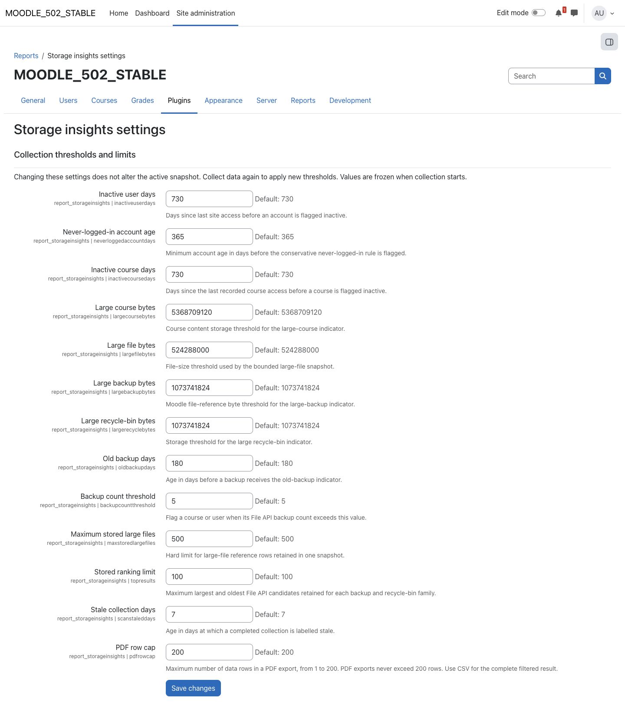
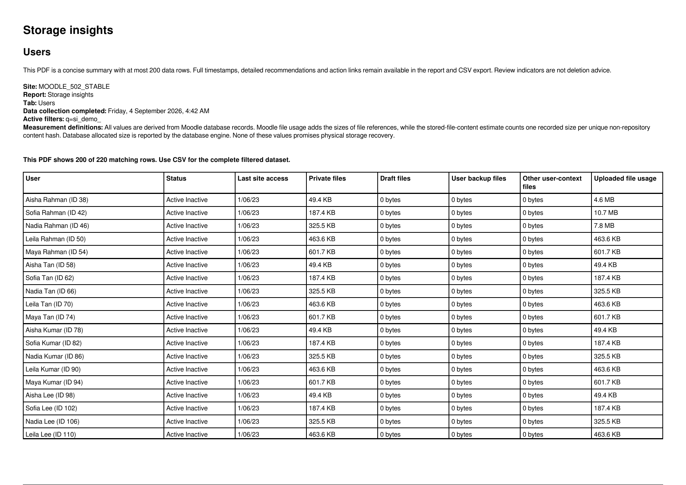
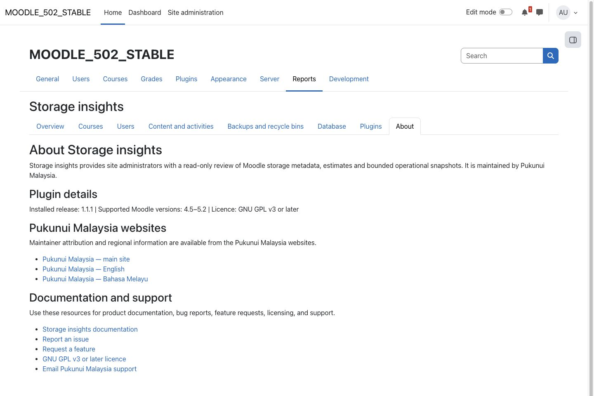

> **Pre-release product:** This product is ready for release and awaiting Marketplace publication. Its Marketplace listing may not yet be available.

# Storage insights

Storage insights helps Moodle site administrators understand where file usage is recorded and which courses, users and content areas deserve a closer look. It brings database-derived file estimates, database allocation and review indicators together in one read-only report for Moodle 4.5 through 5.2.

Collection is started manually and continues in bounded background tasks. You can keep using the previous completed snapshot while a new collection runs. The report never reads file contents or server directories, and it does not delete, archive or modify learning content.

## Key features

- Review an overview of estimated stored file content, database allocation, logical file usage and items flagged for administrator review.
- Explore eight tabs: Overview, Courses, Users, Content and activities, Backups and recycle bins, Database, Plugins, and About.
- Search, sort and filter snapshot tables, follow links to native Moodle review pages, and choose up to 200 rows per on-screen page.
- Compare course and user storage, content areas, large-file candidates, backups and recycle-bin references without treating overlapping categories as extra physical storage.
- View descriptive plugin file usage and reliably measurable course or instance use from database records.
- Export the filtered results to CSV, produce a PDF with at most 200 data rows, or open a printer-friendly view.
- Stop collection safely after the current database batch. Failed or cancelled collections retain the previous completed snapshot.

## Screenshots

### Overview and measurement guidance

*The overview keeps file-content estimates, database allocation and logical usage visibly distinct. These are example measurements from a small demonstration site, not a promised storage saving.*

### Courses

*Filter a populated course list, compare recorded usage and open the native Moodle course for further review.*

### Users

*User results resolve current names when viewed. The filtered demonstration cohort also illustrates the difference between paginated results and full CSV exports.*

### Content and activities

*Compare recorded content areas without adding overlapping views together as reclaimable space.*

### Backups and recycle bins

*Backup entries are review references. Their logical size does not establish how much disk space would be recovered by deletion.*

### Database

*Database allocation is reported separately from File API usage and is not a guarantee of recoverable disk space.*

### Plugins

*The Plugins tab is descriptive. It does not scan plugin source code, infer database-table ownership or recommend removing plugins.*

### Settings

*Review thresholds apply to the next collection. The PDF row cap can be reduced, but cannot exceed 200.*

### PDF export

*The PDF states that 200 of 220 matching rows are included. CSV retains all 220 matching records.*

### About

*Installed release and compatibility details appear alongside maintainer and support information.*

All people and content shown are fictional demonstration data. Course and user screenshots are filtered to the demonstration academy and cohort.

## Requirements

- Moodle 4.5 LTS, 5.0, 5.1 or 5.2.
- Site-administrator access.
- Moodle cron configured to process ad hoc tasks.
- No additional plugin or external service is required.

MySQL/MariaDB and PostgreSQL have database-allocation adapters. Other database families show allocation measurements as unavailable. Supported Moodle versions and database requirements should be checked before upgrading the site.

## Installation

Marketplace publication is pending. If Pukunui has provided the pre-release Storage insights ZIP, open **Site administration > Plugins > Install plugins**, upload the ZIP and complete Moodle's validation and upgrade steps.

Open **Site administration > Reports > Storage insights settings** to review thresholds, then open **Site administration > Reports > Storage insights** to collect data. Existing installations upgrading to 1.1.1 have PDF limits above 200 reduced to 200; lower valid limits are preserved.

## Configuration and use

### Collect and refresh data

Choose **Collect data** when no completed snapshot exists, or **Refresh data** to collect an updated snapshot. Moodle cron carries out the work through ad hoc tasks; there is no recurring collection schedule.

Each task works for at most four minutes. If more work remains, the next continuation is delayed by at least one minute. Large collections can therefore take several task invocations. Progress is an estimate, and reports continue to show the last successfully completed snapshot until the replacement is ready.

Use **Stop collection** to request a stop after the current batch. Partial report records are then cleaned up in bounded batches before the collection becomes cancelled. This cleanup affects the plugin's incomplete snapshot records only, not Moodle learning content.

### Understand the measurements

- **Moodle file usage** is logical File API usage: each file reference contributes its recorded size. Several references may point to identical stored content.
- **Estimated stored file content** counts one recorded size per unique local content hash. It excludes repository-reference files and is derived entirely from database metadata.
- **Database allocated size** comes from the database engine. Deleting records does not necessarily reduce allocation immediately.
- **Review candidates** are items matching configured rules. They are not confirmed safe-to-delete items or guaranteed storage savings.

Confidence labels describe measurement reliability, not deletion safety. A zero measurement and an unavailable measurement are different states. Course, user, activity, backup, recycle-bin and plugin categories can overlap; never sum them into a reclaimable-storage total.

Collection captures source-table ID boundaries and threshold settings at the start. Newer rows are excluded, but records updated or deleted during collection can still produce an approximate mixed-time snapshot. A database-derived estimate does not measure physical disk usage, remote object storage, delayed trash cleanup or infrastructure costs.

### Review courses, users and content

Use the tab filters and **Apply filters**, or choose **Reset filters** to clear them. Tables default to 50 rows per page and offer up to 200. Sort a supported column and follow native Moodle review links where available. Only act on course or user content after checking it in its owning Moodle feature.

Large-file and backup/recycle reference lists are bounded to keep snapshots manageable. Aggregate totals still cover the collected records. User upload attribution and user-context storage answer different questions and should not be added together without considering overlap.

### Choose review thresholds

Settings include user and course inactivity periods, large-course/file/backup thresholds, backup age and count rules, and limits on stored candidates and top results. Changes to collection thresholds take effect on the next collection; they do not recalculate an existing snapshot.

### Export a concise PDF or the complete CSV

**Export PDF (up to 200 rows)** creates a landscape presentation of the filtered results with a maximum of **200 data rows**. PDF uses selected columns, short dates and concise review labels; full timestamps, detailed recommendations and action links remain available in the report and CSV. A lower **PDF row cap** can be selected in settings. When more rows match, the PDF states how many are shown and directs you to CSV for the complete filtered dataset. The limit applies to data rows, not pages: wide tables and long cells can still produce several pages.

**Export CSV** includes the complete filtered dataset available in the active snapshot and is not limited by the PDF cap or current on-screen page. **Printer-friendly view** is also independent of the PDF cap. Exports include report identity, collection completion time, active filters and measurement definitions. Viewing or exporting a report never starts collection.

### Check plugin information

The **About** tab provides the installed release, supported Moodle range, licence, Pukunui Malaysia websites, documentation and support links.

## Privacy and permissions

Every report, status and export route is restricted to site administrators, with the relevant view, run-collection or export capability also checked. Granting a capability to another role does not remove the explicit site-administrator requirement. Starting or stopping collection requires an authenticated, protected request.

The plugin stores aggregate snapshot information, the requesting administrator's user ID, user IDs with derived storage/access information, and bounded file or backup references. Names, usernames, email addresses and filenames are resolved from Moodle when needed rather than copied into snapshot display fields. Administrators may export live-resolved names and filenames, so downloaded files should be handled as administrative data.

Moodle's Privacy API supports discovery, export and deletion of the plugin's stored personal information. Storage insights sends no data to an external service, does not inspect file payloads or server paths, and provides no content-cleanup controls. It writes only its own collection/snapshot records, required ad hoc tasks and normal Moodle events/logs.

## Troubleshooting

- **Collection remains pending:** confirm that Moodle cron is running and processing ad hoc tasks. Allow at least one minute between continuation tasks.
- **A previous result remains visible:** this is expected while collection runs or after a failure or cancellation. Check the displayed collection completion time and status.
- **Collection failed:** inspect Moodle's task logs, correct the reported cause and retry. A failed collection does not replace the last completed snapshot.
- **A stop request still shows Stopping:** allow the current database batch and paced partial-snapshot cleanup to finish.
- **Allocation is unavailable:** the database family may not have an adapter, or its account may lack metadata access. Read the report warning; unavailable does not mean zero.
- **Logical usage is larger than the stored-content estimate:** multiple File API references can share one content hash. This is expected and does not prove wasted or safely removable space.
- **Some large files or backups are missing from the list:** candidate/reference lists are bounded; review configured limits and distinguish their rows from complete aggregate totals.
- **The PDF omits matching rows:** the PDF contains at most 200 rows, or the lower configured limit. Narrow the filters or use CSV for the complete filtered dataset.
- **The report is unavailable to a manager or teacher:** Storage insights is deliberately restricted to site administrators.

## Support and licence

- [Report a Storage insights product issue](https://github.com/PukunuiMalaysia/moodle-docs/issues/new?template=product-bug.yml)
- [Request a Storage insights feature](https://github.com/PukunuiMalaysia/moodle-docs/issues/new?template=feature.yml)
- [Report a documentation issue](https://github.com/PukunuiMalaysia/moodle-docs/issues/new?template=documentation.yml)
- [Pukunui Malaysia support](https://pukunui.com/location/malaysia/)
- [Email Pukunui Malaysia support](mailto:hello.my@pukunui.com)

Storage insights is licensed under the [GNU General Public License v3 or later](https://www.gnu.org/licenses/gpl-3.0.html). This documentation is licensed under [CC BY 4.0](https://creativecommons.org/licenses/by/4.0/).
