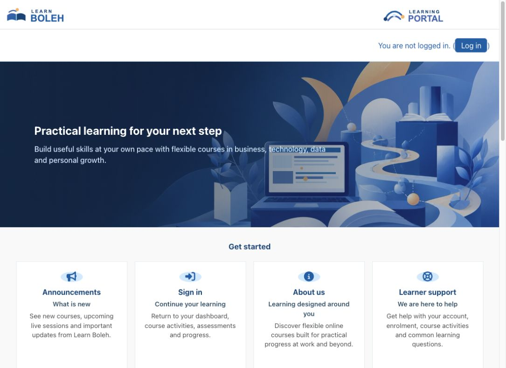
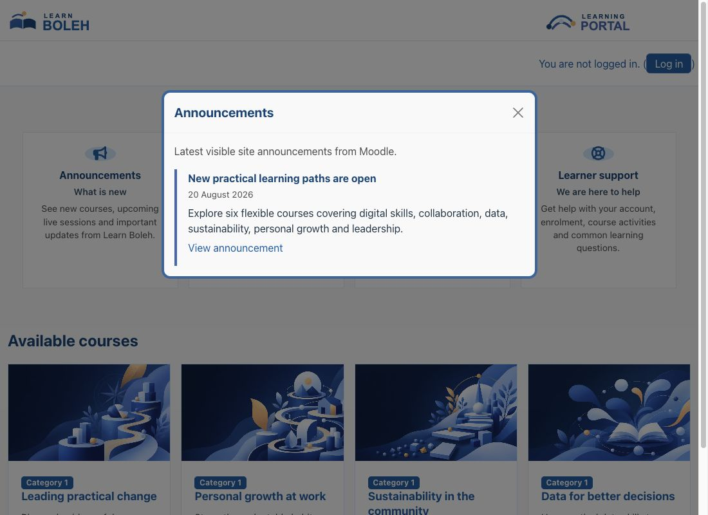
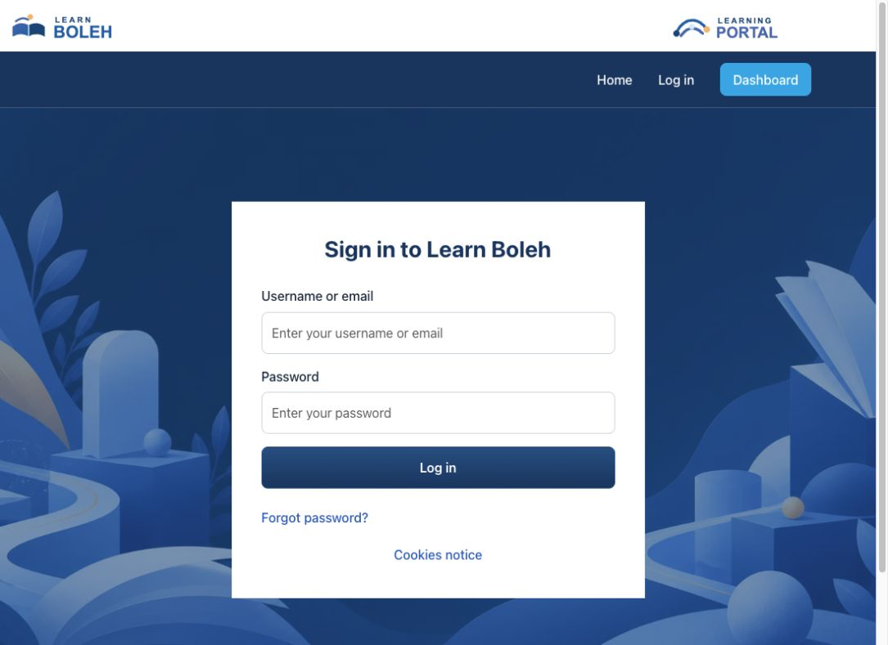
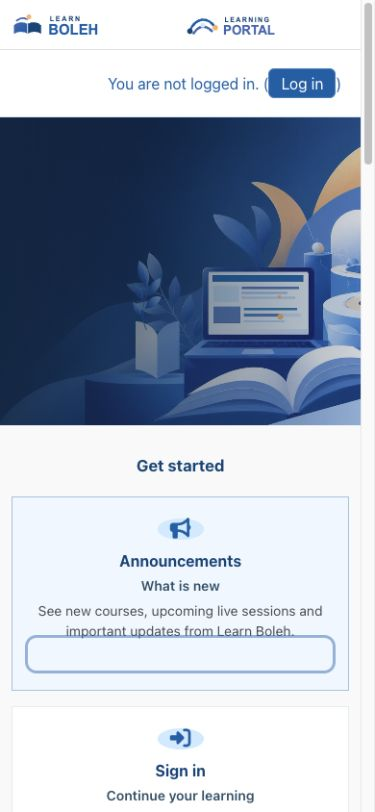

> **Pre-release product:** This product is ready for release and awaiting Marketplace publication. Its Marketplace listing may not yet be available.

# Boleh

Boleh is a Boost-based Moodle theme for organisations that want a clean, branded learning experience without replacing Moodle's standard navigation and course workflows. It combines configurable branding, a video-led site home, course presentation options, accessibility preferences, and responsive layouts in one theme.

## Key features

- Configure organisation and learning-platform logos, colours, typography, spacing density, favicon, and optional dual-brand mastheads.
- Use the bundled site-home video and poster, or replace them with an administrator-uploaded image or MP4 video.
- Build a branded site home with banner content, quick links, announcements, marketing cards, sponsors, and clients.
- Present courses with configurable cards, Moodle overview images, stable bundled fallback media, and optional course-page covers.
- Choose a light or dark navbar treatment while retaining Moodle's primary navigation, user menu, messages, notifications, edit switch, course index, and drawers.
- Give users presentation preferences for toolbar visibility, font size, colour mode, and a dyslexia-friendly font.
- Apply responsive Boleh styling to the login page, dashboard, courses, activities, reports, administration pages, and footer.

## Screenshots

### Site home

*The site home uses Boleh's bundled video header and poster. Administrators can replace this media with their own MP4 video or image. All people, courses, organisations, and content shown are fictional demonstration data.*

### Announcements

*A site-home quick link can open current Moodle announcements in an accessible modal. All people, courses, organisations, and content shown are fictional demonstration data.*

### Login page

*The responsive login page supports configured branding and background media while preserving Moodle's normal sign-in workflow. All people, organisations, and content shown are fictional demonstration data.*

### Mobile site home

*The masthead, navigation, header media, quick links, and course discovery adapt to a narrow screen. All people, courses, organisations, and content shown are fictional demonstration data.*

## Requirements

- Moodle 4.5 LTS through Moodle 5.2.
- Moodle's Boost theme, which is included with Moodle.
- A modern supported browser.
- No additional Moodle plugin or external service is required for normal operation.

One current Boleh release package supports the full Moodle 4.5–5.2 range. Keep Boleh updated when upgrading Moodle, and confirm compatibility before moving beyond that published range.

## Installation

Marketplace publication is pending. If Pukunui has provided the pre-release Boleh ZIP, open **Site administration > Plugins > Install plugins**, upload the ZIP, complete validation, and follow the displayed upgrade steps. Then open **Site administration > Appearance > Theme selector** and select **Boleh**.

## Configuration and use

### Choose branding and appearance

Open **Site administration > Appearance > Themes > Boleh**. Under **Branding & appearance**, configure the organisation logo, optional learning-platform logo, masthead background, favicon, colour palette, body and heading fonts, and spacing preset. When a learning-platform logo is present, Boleh displays a dual-brand masthead while keeping both logo aspect ratios intact.

Fresh installations can use Boleh's bundled starter media. Administrator uploads take precedence over bundled logos and imagery. Disable **Use bundled starter media** if the site should use colour fallbacks until custom media is supplied.

### Configure navigation and course display

Under **Navigation**, choose the light or dark navbar style and its colours. Under **Course display**, choose the standard course presentation or course covers, control course-list presentation, and configure teacher-image behaviour.

Courses without a Moodle overview image can use one of six bundled fallback images selected consistently for that course. A real overview image always takes precedence, and the fallback does not replace a configured course-page cover.

### Build the site home

Use **Site home header** to upload a header image or MP4 video and set the banner heading, content, and colours. Use **Site home content** to configure quick links, announcements, marketing items, sponsors, and clients.

Guests and signed-in users share the configured header media, banner, and optional marketing content on the site home. Signed-in users keep Moodle's normal navigation and editing controls. Dashboard and course pages do not receive the site-home header.

### Review changes

After changing theme settings or media, purge Moodle caches and inspect the guest and signed-in site home, login page, dashboard, course and activity pages, administration pages, drawers, modals, and mobile layouts. Review custom styling in both navbar modes and with accessibility preferences enabled.

## Privacy and permissions

Boleh stores site-level theme configuration and user preferences for accessibility-toolbar visibility, font size, colour mode, and font type. Its Moodle Privacy API provider declares and exports those preferences. Boleh does not require an external service for normal operation and does not send these preferences outside Moodle.

Only authorised site administrators can change theme settings and uploaded media. Each user's accessibility preferences affect that user's presentation only. Normal Moodle roles and capabilities continue to control access to courses, activities, reports, administration, and editing features.

## Troubleshooting

- If a visual or media change is not visible, confirm that Boleh is the active theme and purge Moodle caches.
- If uploaded media is missing, reopen the relevant Boleh setting, confirm that the file was saved, and check that the browser can load it through Moodle's File API.
- If the bundled images appear unexpectedly, review **Use bundled starter media** and the relevant uploaded-media setting.
- If navigation or drawers overlap page content, temporarily remove custom styling and retest with Boleh's standard settings.
- If text or controls have poor contrast, review the selected navbar mode, configured colours, and enabled accessibility colour mode.
- If course cards show fallback images, add a Moodle course overview image where a course-specific image is required.
- After a Moodle upgrade, install the latest compatible Boleh release, complete Moodle's upgrade process, and purge caches.

## Support and licence

- [Report a Boleh product issue](https://github.com/PukunuiMalaysia/moodle-docs/issues/new?template=product-bug.yml)
- [Request a Boleh feature](https://github.com/PukunuiMalaysia/moodle-docs/issues/new?template=feature.yml)
- [Report a documentation issue](https://github.com/PukunuiMalaysia/moodle-docs/issues/new?template=documentation.yml)
- [Pukunui Plugin Subscription Terms & Support Policy](https://pukunui.com/docs/policy-moodle-marketplace/)
- [Pukunui Malaysia support](https://pukunui.com/location/malaysia/)

Boleh is licensed under the GNU General Public License v3 or later. This documentation is licensed under [CC BY 4.0](https://creativecommons.org/licenses/by/4.0/).
