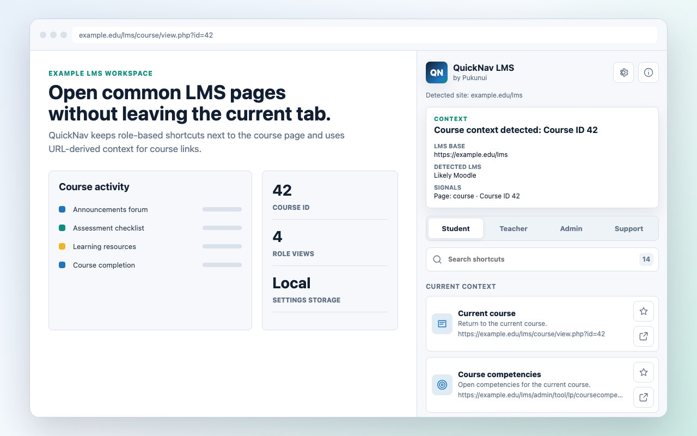
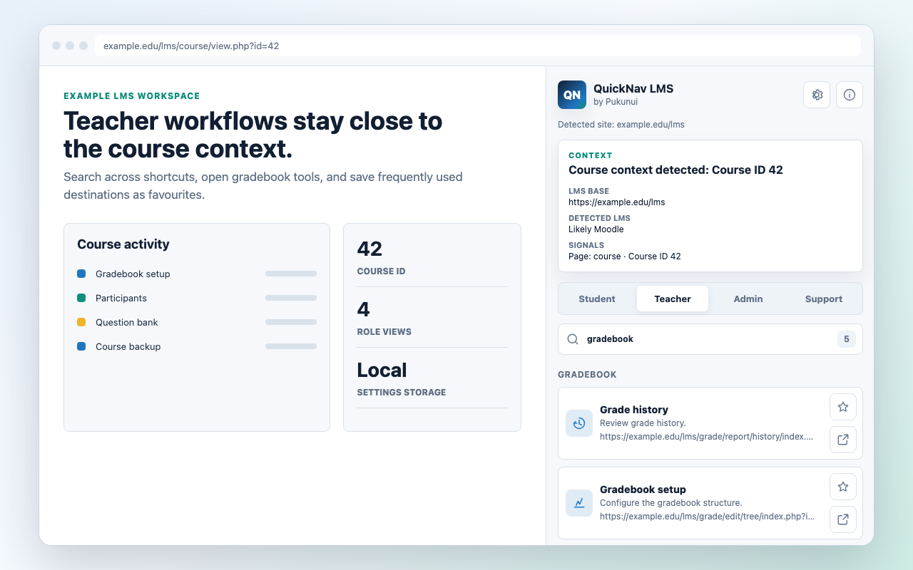
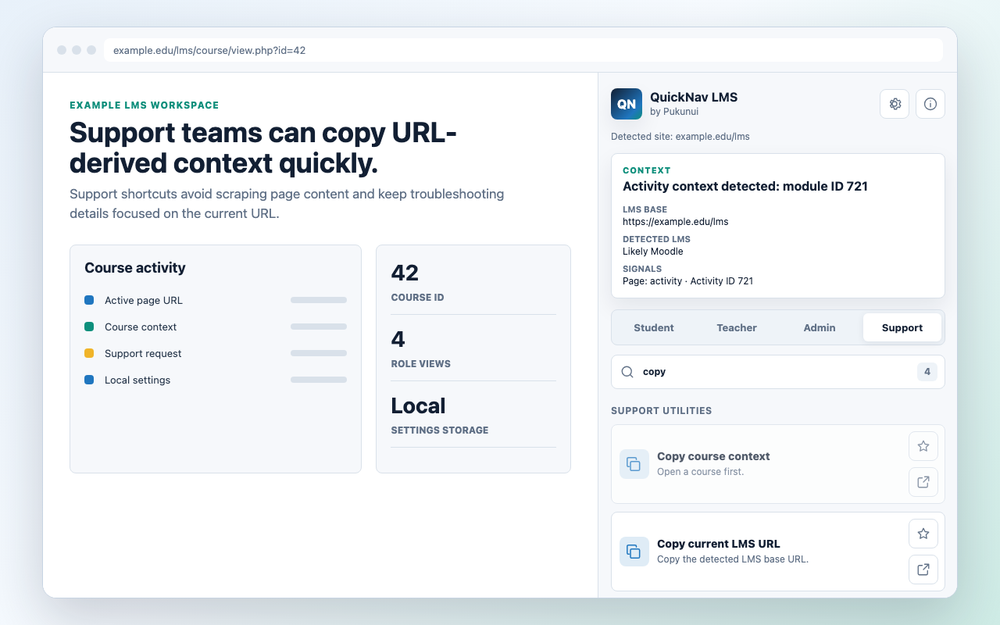
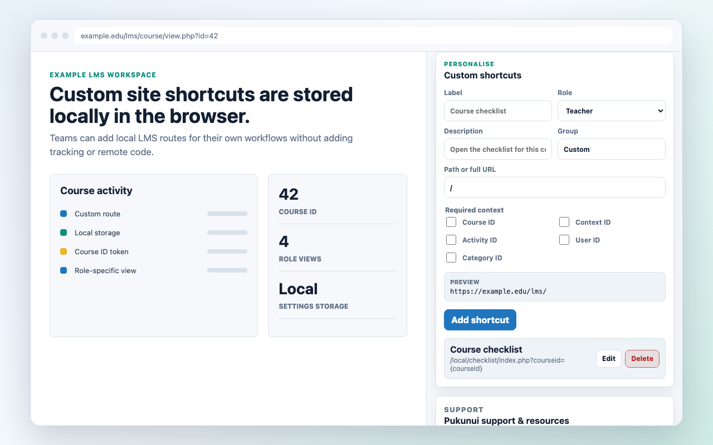
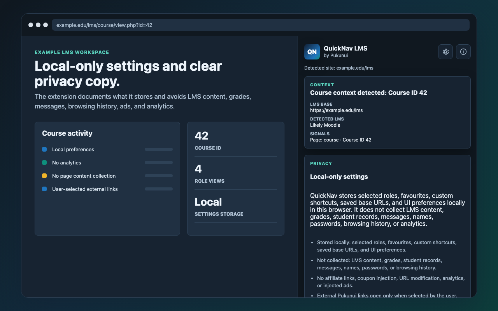

# QuickNav LMS by Pukunui

QuickNav LMS by Pukunui gives learners, teachers, administrators, and support teams a searchable Chrome side panel of role-based, context-aware shortcuts for LMS sites, including sites compatible with Moodle software.

## Key features

- Organise shortcuts into Student, Teacher, Admin, and Support views.
- Enable course, activity, user, and category destinations only when the active page supplies the required context.
- Search shortcut labels, descriptions, keywords, groups, and paths.
- Save favourites, site-specific custom shortcuts, and base-URL overrides locally.
- Support root and subdirectory LMS installations without broad host permissions.
- Leave authentication and authorisation decisions to the LMS.

## Screenshots

### Shortcut overview

*The side panel groups frequently used destinations by role. All people, sites, and content shown are fictional demonstration data.*

### Teacher search

*Search narrows shortcuts by their labels, descriptions, and keywords. All people, sites, and content shown are fictional demonstration data.*

### Support tools

*Support shortcuts are enabled only when the current LMS page supplies the required URL context. All people, sites, and content shown are fictional demonstration data.*

### Custom shortcuts

*Users can add shortcuts for a specific LMS base URL. All people, sites, and content shown are fictional demonstration data.*

### Local-only privacy

*QuickNav stores preferences locally and does not collect LMS content. All people, sites, and content shown are fictional demonstration data.*

## Requirements

- A current version of Google Chrome with Manifest V3 and side-panel support.
- Access to an HTTP or HTTPS LMS site.
- The signed-in LMS account must already have permission to use each destination.
- No external account, service, or credential is required.

## Installation

Install [QuickNav LMS by Pukunui](https://chromewebstore.google.com/detail/quicknav-lms-by-pukunui/hdgmpngamakcijgdghonfkglggbbcjgg) from the Chrome Web Store. Open an LMS page, select the QuickNav extension action, and open the side panel.

## Configuration and use

### Choose a role and shortcuts

Select Student, Teacher, Admin, or Support, then search or browse the available shortcuts. A shortcut remains unavailable when its required course, activity, user, or category identifier is absent from the active URL.

### Favourites and custom shortcuts

Mark common destinations as favourites or add a custom site shortcut. These choices are kept separately for each LMS base URL and role.

### Site detection

QuickNav supports root and subdirectory LMS installations. If automatic detection is unsuitable for a customised site, save a manual base-URL override for that origin. LMS version, routing, theme, plugins, and permissions can still affect the final destination.

## Privacy and permissions

QuickNav stores the selected role, favourites, custom shortcuts, base-URL overrides, and interface preferences in Chrome local storage. It does not collect or transmit LMS content, grades, student records, messages, names, passwords, browsing history, analytics, or advertising data.

The extension uses side-panel, active-tab, tabs, storage, and limited scripting permissions. It does not request broad host permissions, inject advertising, rewrite LMS links, or add tracking parameters.

## Troubleshooting

- If course shortcuts are disabled, open a course page whose URL contains a course identifier.
- If a shortcut opens the wrong site path, save a manual base URL for that LMS origin.
- If an administration shortcut is denied, confirm that the signed-in LMS account has the required permission.
- When reporting a route problem, include the LMS version and starting page but remove personal or confidential site data.

## Support and licence

- [Report a QuickNav LMS product issue](https://github.com/PukunuiMalaysia/moodle-docs/issues/new?template=product-bug.yml)
- [Request a QuickNav LMS feature](https://github.com/PukunuiMalaysia/moodle-docs/issues/new?template=feature.yml)
- [Report a documentation issue](https://github.com/PukunuiMalaysia/moodle-docs/issues/new?template=documentation.yml)
- [Pukunui Malaysia](https://pukunui.com/location/malaysia/)

QuickNav LMS by Pukunui is licensed under the MIT License. This documentation is licensed under [CC BY 4.0](https://creativecommons.org/licenses/by/4.0/).

Moodle™ is a trademark of Moodle Pty Ltd. QuickNav LMS by Pukunui is not affiliated with, endorsed by, or sponsored by Moodle Pty Ltd.
